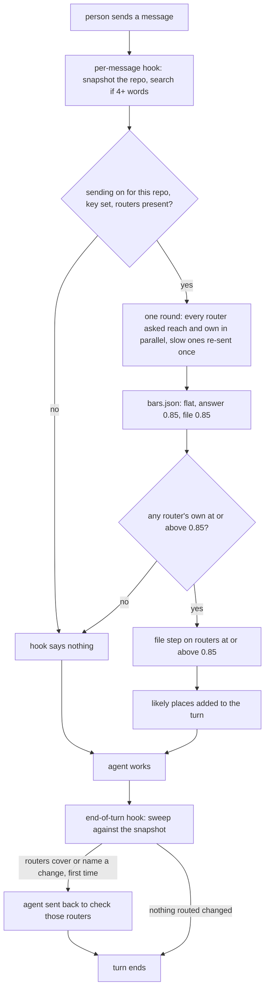

# Completion Report — Highways: router creation, upkeep and fast search

Written for a hostile reviewer: every claim checkable, no claim without evidence.

Three Stage 3 runs built this. The first built everything except the bars and stopped when the
first test set failed (work repo, D52); the second redrew the test set and stopped when the
live run missed the 50% answered gate; the third added D64–D67 and passed. Line numbers below are
in the highways repo (`/home/collin/projects/personal/highways`) unless prefixed `wheelchair:`.
Wheelchair's changes are commits `73632df` and `31cd143` on its branch `highways-routers`.

## What the change does



## Spec coverage

| Spec item | Origin | Implemented at (file:line) | Validated by |
|-----------|--------|----------------------------|--------------|
| Phase 0 live ZDR check (D34, D43) | pre-existing | PLAN.md Log 2026-10-02 (HTTP 200, `typesafe/jev-1.13` on the ZDR list, Collin confirmed account ZDR-only) | Log entries |
| Layout of the repo | pre-existing / this run | `bin/`, `highways/`, `create/`, `protocol/`, `hooks/`, `skills/`, `codex/`, `install.sh`, `search/bars.json`, `test/`; root router `AGENTS.md` (+ `CLAUDE.md` → `AGENTS.md`) | `create/scan.sh .` reports one router at the root |
| Commands (D30): `search`, `scan`, `sweep`, `enable`/`disable`, `default`, `eval draft/written/review/score/latency` | pre-existing | `highways/cli.py:65` (dispatch; `sweep`/`snapshot`/`eval` delegate whole argv); `highways/evalset.py` `main` | `test/test_search.py`, `test/test_eval*.py`, `test/hooks.sh` |
| Search step 1: discovery, symlink pairs, outside links skipped (D59, D62) | pre-existing (R1, second run) | `highways/routers.py:21` `_inside`, `:26` `discover` | `test_router_link_outside_repo_is_never_read_or_sent`, `test_symlink_pair_is_one_router_and_search_does_not_change_repo` |
| Search step 2: switch outside the repo, terminal-only enable (D13, D14, D38) | pre-existing | `highways/config.py:46` `enabled`; `highways/cli.py:25` `_confirm` | `test_enable_refuses_without_terminal_and_outside_repo_is_one`, `test_off_and_no_routers_send_nothing` |
| Search step 3: key from `OPENROUTER_API_KEY` (D35) | pre-existing | `highways/search.py:164` `search` | unittest |
| Search step 4: one round, `zdr: true` on every request (D28, D31, D34) | pre-existing | `highways/decisions.py:19` `_one`, `:22` provider `zdr` | `test_zdr_and_file_step_only_existing_named_files` |
| Search step 4: resend at 0.35 s, first valid answer wins, search round only, remaining-budget timeout, never delays exit (D64, D65) | this run (S1) | `highways/decisions.py:51` `batch` (daemon threads, `resend_after`); `highways/search.py:176` | `test_slow_router_is_resent_once_and_uses_second_answer`, `test_failed_router_is_resent_promptly`, `test_two_slow_router_attempts_are_unavailable_without_third_send`, `test_quick_router_answer_is_not_resent`, `test_file_step_and_unbudgeted_score_never_resend`, `test_late_failed_resend_never_replaces_a_valid_first_answer`, the timed subprocess case |
| Search steps 5–6: walk, flat mode, rank, cap (D22, D44, D45, D20) | pre-existing | `highways/search.py:48` `walk` | `test_root_is_answer_and_real_cli_json`, `test_child_answer`, `test_weak_parent_hides_child`, `test_flat_skips_walk`, `test_not_confident`, `test_cap_of_five` |
| Search step 7: file step, each question names its file (D16, D19, D51) | pre-existing | `highways/search.py:84` `named_files`, `_file_body` | `test_zdr_and_file_step_only_existing_named_files` |
| Search step 8 and bars file validation | pre-existing | `highways/search.py:150` `_bars` (with `HIGHWAYS_BARS` seam), `:164` | `test_bad_bars_are_unavailable` |
| Bars set by the test set | this run (S3) | `search/bars.json` = `{"answer": 0.85, "cap": 5, "file": 0.85, "mode": "flat", "walk": 0.5}`, commit `41b8913` | `eval latency` pass (below) |
| Test set: draft, written, review, floors, leak rule (D26, D37, D50, D55, D56, D58, D60–D63) | pre-existing | `highways/evalset.py:284` `draft`, `:207` `written`, `:190` `_leaks`, `:394` `_floor_and_leaks`, `:45` `_inherit_promisor`; `highways/eval_review.py:300` `run`, `:94` `edit`, `:116` `finish` | `test/test_eval.py`, `test/test_eval_written.py`, `test/test_eval_review.py` |
| Test set: metrics per pool/repo/origin, unanswerable, gates (D46, D48, D49, D60, D62) | pre-existing | `highways/evalset.py:450` `_metrics`, `:494` `_metric_groups` | `test/test_eval.py`, `test/test_eval_written.py` |
| Test set: 45% selection limit and gate, ±0.02 margin, worst-case ranking (D64, D66, D67) | this run (S2) | `highways/evalset.py:503` `_passes_selection`, `:515` `_shifted`, `:539` `_best_for_mode`, `:566` `_gates` | `test/test_eval_margin.py` |
| Test set content: wheelchair and mechanical-quill, 113 reviewed questions (D52, D53, D57) | pre-existing | `~/.cache/highways/eval/{wheelchair,mechanical-quill}-questions.jsonl`, `*-written-1-questions.jsonl` (all `reviewed: true`) | PLAN.md Log 2026-10-03 |
| Per-message hook (D11, D12, D33, D40) | pre-existing | `hooks/prompt.sh`, `highways/hooks.py:45` `prompt`, `highways/snapshot.py:62` `take` | `test/hooks.sh` (96 checks); live check below |
| `sweep` and end-of-turn hook (D18, D21, D25, D32, D39, D40) | pre-existing | `highways/sweep.py:69` `changed_paths`, `:90` `map_paths`; `hooks/stop.sh`, `highways/hooks.py:70` `stop` | `test/hooks.sh`; live check below |
| Creation: scanner and suite moved (D7) | pre-existing | `create/scan.sh`, `create/test/run.sh` | `bash create/test/run.sh` 80 passed |
| Creation docs rewritten; search line and navigation order (D41, D45, D46, D48) | pre-existing | `protocol/create.md:148`, `protocol/routers.md:57`, `protocol/sweep.md`, `protocol/search.md` | Creation grep prints nothing (below) |
| Install (wrappers, bin link, hook groups, refusals) | pre-existing | `install.sh:51` (bin link), `:101` (hook groups); `skills/highways/SKILL.md`, `codex/prompts/highways.md` | `bash test/install.sh` 24 passed; real install 2026-10-03 |
| Phase 5 live check in each harness | this run (S4) | — | PLAN.md Log 2026-10-03 S4 entry (below) |
| Wheelchair routes `viewer/` and `codex/` (D57) | pre-existing | `wheelchair:viewer/AGENTS.md`, `wheelchair:codex/AGENTS.md`, root router table and search line (commit `73632df`) | Collin confirmed the pre-write list |
| Wheelchair integration: planning, briefs, sweep, verification, COMPLETION template (D8, D21, D42, D45, D46) | this run (S5) | `wheelchair:protocol/planning.md`, `protocol/map.md`, `protocol/implementation.md`, `protocol/verification.md`, `protocol/templates/COMPLETION.md` (commit `31cd143`) | diff read by the lead; wheelchair suites below |
| Removal from wheelchair (D9) | this run (S5) | commit `31cd143`: `spine/`, `protocol/spine.md`, `protocol/routers.md`, `skills/spine/`, `codex/prompts/spine.md` deleted; listed edits; `install.sh` removes an old rendered `spine` wrapper | phase 6 grep below; install suite 77 |

## Deviations from plan

- The review page (`highways eval review`) was built during implementation at Collin's request
  and folded into the Spec afterwards as D58.
- The first run's test set (work repo) failed every gate, and the second run's live check
  missed the 50% answered gate (47.6%). Both were taken back to planning as the Spec requires;
  D52–D57 and D64–D67 are the resulting changes. The answered-rate gate is 45% by Collin's
  decision D66, made after measurement and recorded as such.
- Wheelchair was on `main`, so both wheelchair commits are on a new branch `highways-routers`,
  not merged.
- Lead fixes to worker output, each logged in PLAN.md: per-file questions named their file;
  one thread per request; CLI passthrough for `sweep`/`snapshot`/`eval`; stale cached answers;
  partial-clone temp clones; the review page's script error and labels; the leak check's word
  boundaries; a late failed resend overwriting a valid answer; the search tests pinned to their
  own bars.
- No `choice` was struck on any run picture, so no follow-up tasks were created.

## Routers

- Highways: new root `AGENTS.md` (with `CLAUDE.md` → `AGENTS.md`) and `.gitignore`, written
  through `/highways create` after Collin confirmed. The end-of-turn hook sent this session back
  twice during the run; both times the router was checked against the changes and was still
  true.
- Wheelchair: new `viewer/AGENTS.md` and `codex/AGENTS.md`; the root router's table links them
  and gains the conditional search line (`73632df`). In `31cd143` the root router, 
  `protocol/AGENTS.md` and `skills/AGENTS.md` dropped the removed `spine/` and `routers.md`
  references and now say routers belong to highways; `codex/AGENTS.md` named no removed file and
  is unchanged.

## Validation evidence

Highways suites, main checkout, 2026-10-03:

```
$ bash create/test/run.sh | tail -1
RESULT 80 passed, 0 failed
$ python3 -m unittest discover -s test
Ran 48 tests in 20.145s
OK
$ bash test/hooks.sh | tail -1
RESULT 96 passed, 0 failed
$ HOME=$(mktemp -d) bash test/install.sh | tail -1
RESULT 24 passed, 0 failed
$ grep -nE "wheelchair|/spine|Stage 3|diagrams\.md|implementation\.md" protocol/create.md protocol/routers.md
(no output, exit 1)
```

Test set (113 reviewed questions: wheelchair 13 drafted + 33 written, mechanical-quill 6 drafted
+ 61 written; 103 answerable, 10 unanswerable):

```
$ highways eval score ...   (flat, answer 0.85, file 0.85; margin low 47.6%, cached 51.5%, high 52.4%)
pool: answered 51.5%, top-wrong 1.9%, false-answer 0.0%, precision 89.7%, file-precision 90.5%, narrowing 0.4%
gates answered_rate=pass, top_wrong_rate=pass, drafted_top_wrong_rate=pass, false_answer_rate=pass, answer_precision=pass, median_narrowing=pass, file_precision=pass

$ highways eval latency ...
latency pool: answered 48.5%, top-wrong 2.0%, false-answer 0.0%, precision 89.1%, recall 47.6%, file-precision 90.2%, file-recall 37.0%, narrowing 0.2%, latency median 0.416s p95 0.618s
latency repo mechanical-quill: answered 63.9%, top-wrong 2.6%
latency repo wheelchair: answered 26.2%, top-wrong 0.0%
gates answered_rate=pass, top_wrong_rate=pass, drafted_top_wrong_rate=pass, false_answer_rate=pass, answer_precision=pass, median_narrowing=pass, file_precision=pass, files_returned=pass, latency_p95=pass
```

Live harness check (copy at `/tmp/highways-live/wheelchair`, sending enabled by Collin, Codex
hooks approved by Collin, no lane markers):
- Claude Code (`claude -p`, session `d94263e3-3394-4167-b149-52ccb941af8f`): the model quoted the
  injected context verbatim ("highways: likely places for this request … viewer — viewer/AGENTS.md
  — 0.88 / viewer/server.js — 0.85"); an edit to `viewer/list.js` got one send-back, "highways
  found routers to check: AGENTS.md: viewer/list.js / viewer/AGENTS.md: viewer/list.js …", and
  the agent checked both and finished.
- Codex (`codex exec`): the same context quoted; the edit's send-back text is in
  `~/.codex/sessions/2026/10/03/rollout-2026-10-03T15-05-13-01a103cc-c27b-…jsonl`, and the agent
  replied "The hook asks me to check both routers …".

Wheelchair, branch `highways-routers` at `31cd143`:

```
$ bash install/test/run.sh | tail -1
RESULT 77 passed, 0 failed
$ bash codex/test/run.sh | tail -1
RESULT 45 passed, 0 failed
$ (cd viewer && npm test)
not ok 31 - a starter that loses the freed port registers through the new holder
# pass 132
# fail 1
$ grep -rn "spine/scan.sh\|protocol/spine.md\|protocol/routers.md\|/spine" . --exclude-dir=docs --exclude-dir=node_modules --exclude-dir=.git
viewer/test/server.test.js:324:    graph.explanation = 'Read [the router](protocol/routers.md) or [the site](https://example.com).';
```

The one viewer failure predates this work: `node --test test/lifecycle.test.js` on unchanged
`main` (`a552802`) in a separate worktree gives `# pass 30 / # fail 1` on two runs.

## Known gaps / residual risks

- Search answers about half of questions (48.5% live): 64% on mechanical-quill, 26% on
  wheelchair, whose routing is coarser. Collin asked to discuss raising this later.
- The bars were tuned and gated on the same 113 questions, from two repos in one router style
  (Accepted Risks).
- Jev's scores for an identical request move by about 0.01; the ±0.02 margin covers answers
  crossing the bar, not noise that reorders answers.
- Wheelchair's pre-existing viewer test failure (`lifecycle.test.js`, "a starter that loses the
  freed port …") is not addressed here; by Collin's decision it is recorded as an existing failure
  in wheelchair `docs/known-issues.md`.
- `_named_at_tree` in `highways/evalset.py` still splits a backticked name on whitespace, so a
  router-named file with a space would not count as an expected file in the test set (no effect
  on the current bars; noted by the round-2 verifier).
- Nothing in the highways repo is committed except `search/bars.json` (`41b8913`); the
  wheelchair branch is not merged.
- The real install left highways' hooks active in every session; sending stays off except for
  repos Collin enables (`/tmp/highways-live/wheelchair` was switched back off).

## Remediation rounds

### Remediation 1 — 2026-10-03

Gaps and tasks: `REMEDIATION-1.md`. Fixed:
- M1: discovery skips routers inside nested repositories (`highways/routers.py` `_in_nested_repo`).
- M2: `score` fails when no setting qualifies (`highways/evalset.py`, candidate `passed`).
- M3: snapshot records a symlink's target text and never raises (`highways/snapshot.py` `status_paths`).
- M4: malformed config falls back to sending off (`highways/config.py` `read`).
- M5: backticked names keep spaces and `#` (`highways/search.py` `named_files`).
- M6: `latency` writes `$HIGHWAYS_BARS_TARGET` when set; tests never touch `search/bars.json`.
- M7 (lead): both git calls in `create/scan.sh` pass `--no-optional-locks`; highways' root router's
  `create/` row corrected to say so.
- M8, M9: wheelchair commit `627d023` (root router's maintenance sentence; installer cleanup
  limited to this checkout's own wrapper).

Not fixed: wheelchair's viewer test "a starter that loses the freed port registers through the
new holder" fails identically on unchanged `main` (`a552802`). Collin's decision: record it as an
existing failure. It is written up in wheelchair `docs/known-issues.md` (commits `73f7a65`,
`037e6ec` on `highways-routers`), with how to reproduce it and where to look, and the root
router's `docs/` row names that file. Phase 6's "wheelchair's own suites pass" holds for every
suite except this one pre-existing test.

Validation after remediation (lead):

```
highways: create 80 passed; unittest 52 OK; hooks 110 passed; install 24 passed
search/bars.json: same mode and mtime before and after the full unittest run
wheelchair: install 78 passed (627d023)
```

Correction to the Validation evidence above: the Claude Code send-back is in session
`49fe6f35-bc97-4dcb-907b-326246b54ef5`; session `d94263e3` holds the injected context.

### Remediation 2 — 2026-10-03

Gaps and tasks: `REMEDIATION-2.md`. Fixed in a fresh Terra lane at `xhigh`
(thread `01a103ef-849c-7f70-9aa5-f007d5f70ded`):
- N1: a settings file that parses but is malformed anywhere counts as sending off everywhere
  (`highways/config.py` `read`; D68).
- N2: the test-set tools read router-named files with the same token rule as search
  (`highways/evalset.py` `_named_at_tree`).

Validation after remediation (lead): create 80 passed; unittest 54 OK; hooks 110 passed;
install 24 passed; `search/bars.json` unchanged. Collin's real settings file is well-formed and
still reads as before (sending off for `/tmp/highways-live/wheelchair`).

### Verification — 2026-10-03

Round 3: GPT / Sol `VERDICT: PASS`. Round 2: Claude default reviewer `VERDICT: PASS`. Both checks
crossed families (Claude checked the GPT lanes' work; Sol checked the Claude lanes' work).

