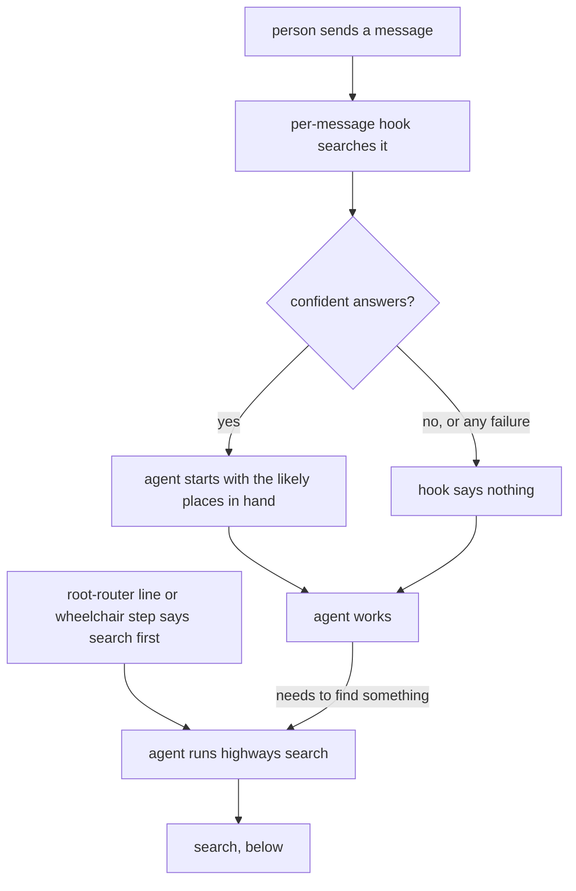
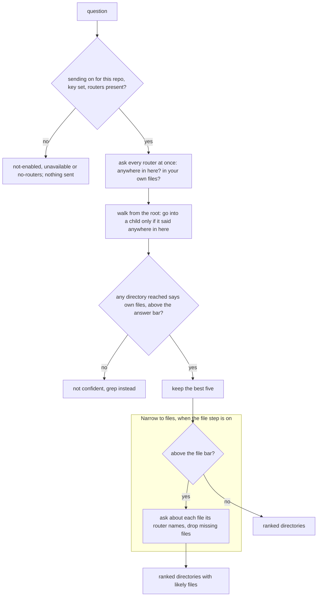
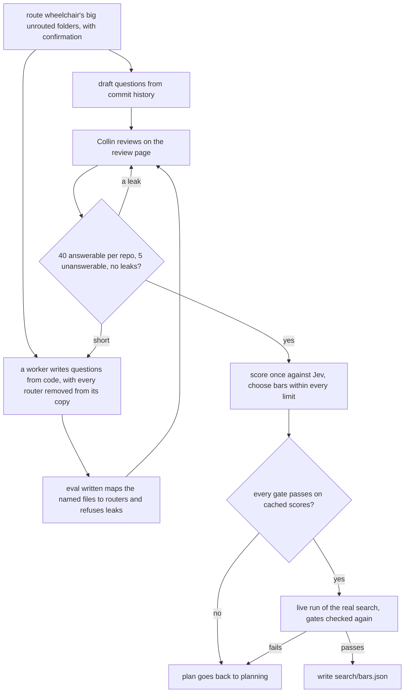
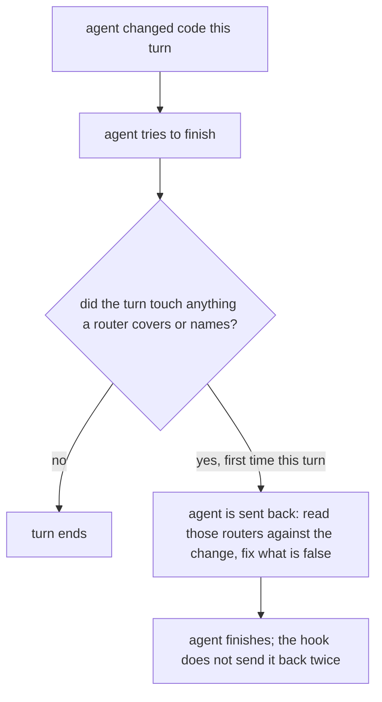

# Highways: router creation, upkeep and fast search

**Idea:** `IDEA.md` — what this is for and why, in plain language. Read it first; it is
the north star this plan serves. Goal and Constraints live there, not here, so they don't
get buried as this file grows.

## Open Questions

Ordered by leverage; discussed one at a time. A settled question moves to the Decision
Log and is deleted from here.

## Watch List

Things noticed that need looking into — not yet decisions for the user. Written down the
moment they're spotted so they can't be forgotten, surfaced to the user one line at a
time as they appear, and emptied before Stage 1 exits.

Each item ends up settled by the agent (noted in the Log), promoted to an Open Question,
promoted to a Constraint or Accepted Risk, or waved off by the user.

| # | Noticed | What needs looking into | Raised to user? | Outcome |
|---|---------|-------------------------|-----------------|---------|
| W1 | 2026-10-02 | Jev is unverified: access, real API shape, latency, and whether its probabilities compare across separate calls. Since D28: whether OpenRouter passes Jev's typed answers and their probabilities through. Partly checked 2026-10-02 from OpenRouter's docs: a dedicated Decisions API (not chat) returns a probability per yes/no question (D31). Still unchecked: whether that alpha endpoint honours the `zdr` provider preference, real latency, and whether probabilities compare across separate requests | yes | Settled by the agent: D34 makes the ZDR check the first task, and it fails closed. Latency and whether probabilities compare across requests are measured by the test set (D27) and recorded as an Accepted Risk |
| W2 | 2026-10-02 | Whether Codex CLI has an end-of-turn hook like Claude Code's `Stop`; Q4's recommendation depends on it. Partly checked 2026-10-02: Codex 0.159.3 accepts a `Stop` entry in `~/.codex/hooks.json` (one is registered there). Not checked: whether a Codex `Stop` hook can send the agent back to work the way Claude Code's can | yes | Settled by the agent, 2026-10-02: Codex Stop hooks support `{"decision": "block", "reason"}` and `stop_hook_active` (codex.danielvaughan.com hooks guide; Codex commit "[hooks] stop continuation & stop_hook_active mechanics", #14532). D32. Re-confirmed live by the hook tests on the installed Codex |
| W3 | 2026-10-02 | How many repos on this machine carry routers, for the test set (MAP.md "Not checked") | yes | Checked 2026-10-02 (every git repo under `~` to depth 7): two codebases, wheelchair (6 routers) and work repo (about 40, 13 checkouts). Became Q6 |
| W4 | 2026-10-02 | Wheelchair files that reference the router pieces and need repointing at removal: `AGENTS.md`, `README.md`, `CONTRIBUTING.md`, `protocol/{AGENTS,implementation,graphs,sensitivity,spine,routers}.md`, `skills/AGENTS.md`, `skills/spine/`, `codex/prompts/spine.md`, `spine/`, `viewer/test/server.test.js` | yes | Settled by the agent: the Spec's "Removal from wheelchair" lists each file and what happens to it. `viewer/test/server.test.js` only uses `protocol/routers.md` as sample prose and needs no change |
| W5 | 2026-10-02 | How the end-of-turn hook knows what this turn changed: the working tree against a snapshot the per-message hook takes at the start of the turn, or plain `git status`, which also shows changes from before the turn | yes | Settled by the agent: D33 |
| W6 | 2026-10-02 | The work repo's routers differ from wheelchair's format: the root is a "kind of work → document to read" table, routers are cumulative instructions, some are 5 to 7 lines, and each `CLAUDE.md` is a symlink to `AGENTS.md`. The own question (D22) relies on a router saying which subdirectories it covers; some here may not | yes | Settled by the agent: search reads router text as prose and never assumes the wheelchair format (wheelchair `protocol/routers.md:128-135` already says an existing router is never measured against it). D27 puts this style in the test set on purpose, so the bars are tuned across both styles. Superseded 2026-10-03 by D52: the work repo left the test set (see Accepted Risks) |

## Decision Log

Append-only. A reversal is a new entry superseding the old, never an edit.

| # | Decision | Rationale | Source |
|---|----------|-----------|--------|
| D1 | Highways keeps routers true automatically as code changes, taking over wheelchair's upkeep; once highways does creation and upkeep, they are removed from wheelchair | Collin's amendment to the draft idea | idea-change |
| D2 | Creating routers still needs a person's confirmation; updating an existing router a change made false does not | Automatic upkeep can't wait on confirmation, and wheelchair's upkeep already edits without asking | idea-change |
| D3 | The search is a command-line program. An MCP server can wrap it later | Both harnesses run shell commands; every wheelchair executable is already a script | defaulted |
| D4 | The model sits behind one interface with Jev as the first backend. With no backend available, search reports "unavailable" and the agent greps | IDEA.md forbids depending on unconfirmed Jev details; grep is the stated fallback | defaulted |
| D5 | Search returns ranked directories, each with its probability and router path, plus an explicit "not confident, grep instead" verdict when the top result is below a threshold. The threshold is set from the test set, not guessed | IDEA.md "never sends an agent confidently to the wrong place" | defaulted |
| D6 | Search reads routers only: no file listings and no code. In a repo with no routers it says so and names the create command | IDEA.md "Not doing": no index of every file or symbol | defaulted |
| D7 | The scanner (`spine/scan.sh` and its tests), the router format and the creation sequence move to highways unchanged in behaviour; only paths change | They are self-contained (MAP.md) and already guarded | defaulted |
| D8 | Wheelchair detects highways by its presence on `PATH`, the rule wheelchair `protocol/lanes.md` already uses for harnesses | Neither tool may require the other; reuse the existing presence rule | defaulted |
| D9 | Removal from wheelchair is this plan's last phase, done only once highways' creation, upkeep and search tests pass with wheelchair absent | IDEA.md "Not doing" and D1 | defaulted |
| D10 | New highways code is Python 3.11+ (already required by wheelchair's `seen/set.sh`); the moved scanner stays bash | No new runtime dependency | defaulted |
| D11 | Agents reach the search two ways: a command the agent runs (prompted by a root-router line and by wheelchair's stages), and an automatic per-message hook that runs the same command on the person's message and speaks only when confident | The hook covers the start of a task without relying on obedience; the command covers mid-task questions and is what wheelchair calls | user |
| D12 | The hook is a `UserPromptSubmit` hook on both harnesses, with a short timeout. It exits silently on every failure, on a non-confident result, outside a repo with routers, and in headless lanes and subagents (the `WHEELCHAIR_LANE` / `agent_id` rule wheelchair's `seen/hook.sh` uses) | A turn the hook delays or blocks is a failure noticed every time; wheelchair's seen hook already proves this shape works on both harnesses (wheelchair `protocol/seen.md`) | defaulted |
| D13 | Sending messages and router text to an outside model is off by default, switched on per repo. A user-level setting flips the default to on, after which a repo can still be switched off | Collin: off by default, with a setting to default on. Nothing leaves the machine for a repo nobody enabled | user |
| D14 | The default setting and every per-repo switch live in one user-level config file outside any repo, keyed by the repo's absolute path. Nothing inside a repo can switch sending on | A repo's own files are attacker-controlled in a clone; a committed switch could make a stranger's repo send your messages out. Same reason wheelchair's seen hook reads nothing inside a repo (wheelchair `protocol/seen.md`) | defaulted |
| D15 | A search asks every router in parallel, separately: "does this directory own X?", and ranks directories by the probability of each answer | Speed doesn't depend on repo depth, and one wrong answer can't hide the right directory. Revisit if Watch W1 finds Jev's probabilities don't compare across calls | user |
| D16 | When the top directory clears a second, higher bar, search asks about each file that directory's router names, drops any that no longer exist, and returns the rest ranked under that directory. Files a router doesn't name are never considered | Collin chose it; it stays inside IDEA.md's "no index of every file" and D6 (routers only) | user |
| D17 | Both bars (directory and file) are set from the test set (Q6), not guessed; the file bar is never lower than the directory bar | Same reasoning as D5 | defaulted |
| D18 | Outside wheelchair, upkeep runs when an agent finishes its turn: an end-of-turn hook checks whether the turn's changes touched a directory with a router and, if so, sends the agent back to check and fix those routers before it finishes. On a harness whose end-of-turn hook can't send the agent back (Watch W2), it warns instead | Fixes happen automatically, at the moment of the change, by the agent that made it | user |
| D19 | Supersedes D16's "the top directory": every directory clearing the file bar gets the file step, not only the top one. The rest of D16 stands | Collin: any router above the threshold gets the second step | user |
| D20 | Search returns every directory that clears the directory bar, ranked, capped at 5; each one that clears the file bar carries its own ranked files | Several right answers are normal (a change spanning two directories); a cap keeps the answer short. The cap is tuned with the bars (D17) | defaulted |
| D21 | The end-of-turn hook follows D12's rules too: silent on failure, and skipped in headless lanes and subagents. Inside a wheelchair run, the lead's sweep after each lane runs highways' sweep instead | One owner per moment: wheelchair's lead already sweeps after lanes (wheelchair `protocol/implementation.md:218-223`) | defaulted |
| D22 | Supersedes D15. Search scores every router in one parallel round with two yes/no questions: "is X anywhere in this directory, subdirectories included?" (reach) and "is X in this directory's own files, or a subdirectory it lists as having no router of its own?" (own). Plain code then walks the router tree top-down over those scores with no further model calls: it enters a directory whose reach score clears the walk bar, and a directory it reaches whose own score clears the answer bar is an answer | Collin's top-down shape with one round of waiting; the own question lets the root be an answer only when X really sits in it (wheelchair's `viewer/` case) | user |
| D23 | The walk also enters a directory whose reach score misses the walk bar when some router inside it has an own score above the answer bar | Every score is already in hand, so one weak parent can't hide a strong answer | defaulted |
| D24 | Three bars (walk, answer, file) all come from the test set; answer ≤ file. Extends D17 | Same reasoning as D5 | defaulted |
| D25 | The agent decides whether a touched router is still true: it reads each router in a directory its turn changed, against its own change, and fixes what's false. No model screens it, and no code leaves the machine for upkeep | Routers are short and only touched ones are read; a model screen would send code out and fail silently, the failure IDEA.md calls worse than no router | user |
| D26 | Test questions come from git history: a commit whose changes sit in one or a few routed directories gives a question (its message) and the right answers (those directories, and any router-named files it touched). Commits touching only routers or more than 5 directories are skipped | Real questions with known answers, no hand-writing, and the same generator works on any repo | defaulted |
| D27 | The test set is wheelchair and the work repo | Collin; only the work repo has routers deep and many enough to test the walk. Its routers are in a different style from wheelchair's (Watch W6), which the test should cover anyway | user |
| D28 | Every model call goes to Jev through OpenRouter with zero data retention required on the request, never to TypeSafe AI directly. Added to IDEA.md Constraints | Collin: the team already serves Jev requests this way; TypeSafe AI directly isn't considered safe | user |
| D29 | Tests on the work repo run on a fresh `git clone` into a temp directory, never in an existing checkout and never through `git worktree` (which writes into the source repo's `.git`). Nothing in the test suite writes to the source checkout | Collin: make a copy so nothing changes unnecessarily | user |
| D30 | One command, `/highways`, with subcommands `create`, `search` and `sweep`, on both harnesses. Highways never ships a `/spine` | One name per tool; two `/spine` commands installed during the overlap would clash | user |
| D31 | Each router is one request to OpenRouter's Decisions API (`POST https://openrouter.ai/api/alpha/decisions`, model `typesafe/jev-1.13`): `state` holds the router's directory path and full text plus the question, and `questions` holds two `noul` (yes/no) questions, `reach` and `own`, each answered with the probability of yes. All routers' requests go out in parallel | OpenRouter's Jev docs: questions about the same state belong in one request, each `noul` answer is a probability, and the window is 32,000 tokens (routers run 5 to 133 lines). Checked 2026-10-02 at openrouter.ai/docs/guides/community/jev and jev-tutorial | defaulted |
| D32 | On both harnesses the end-of-turn hook is a `Stop` hook that sends the agent back with `{"decision": "block", "reason": ...}`, at most once per turn: it does nothing when its input carries `stop_hook_active: true` | Codex's Stop hook supports the same continuation shape as Claude Code's, including `stop_hook_active` (Watch W2). Once per turn rules out a loop | defaulted |
| D33 | "What this turn changed" comes from a snapshot the per-message hook takes at the start of each turn, kept outside the repo: `HEAD`, plus a content hash of every path `git status` reports. At the end of the turn, a path counts as changed if it is in a commit made since that `HEAD`, or is dirty now with a hash that differs from the snapshot's or that wasn't in it. With no snapshot, every path `git status` reports counts | Plain `git status` blames this turn for older edits; nothing may be written into the repo or its `.git` to take the snapshot. Over-reporting only means checking an extra router (Watch W5) | defaulted |
| D34 | Before anything else is built, a live check against OpenRouter's Decisions API must pass: a request carrying `provider: {"zdr": true}` is accepted and answered. If the endpoint refuses or ignores ZDR, highways never sends, and the plan goes back to planning. Highways never sends a request without `zdr: true` | D28 makes ZDR a hard limit, and OpenRouter's docs don't say the alpha Decisions endpoint honours it (Watch W1) | defaulted |
| D35 | The OpenRouter key comes from the `OPENROUTER_API_KEY` environment variable only. No key means search answers "unavailable" | The same variable OpenRouter's own tools use; highways stores no secret | defaulted |
| D36 | Request round budget 1 s, file step 0.5 s; the test set gates on 95th-percentile latency ≤ 1 s | IDEA.md "well under a second"; both reviewers found 3 s + 2 s budgets with no gate | review-round-1 |
| D37 | The test set is drafted from filtered, sampled history (up to 100 commits per repo), reviewed by a person, scored once with probabilities cached and bars swept offline, pooled across repos, and gated on answered rate, top-wrong, answer precision, file precision, narrowing and latency. All of it lives outside any repo | Round 1: commit subjects were mostly bookkeeping, the metric let wrong extras through, there was no minimum usefulness bar, no pooling, and no cost limit | review-round-1 |
| D38 | `highways enable` and `default on` need a terminal and a typed confirmation; the `not-enabled` answer tells the agent only the person can turn sending on | Round 1: the answer invited the agent, or a cloned repo's router, to switch sending on itself | review-round-1 |
| D39 | A changed path also maps to every ancestor router that names it, not only the nearest router | Round 1: wheelchair's root router names `seen/wording.sh` (`AGENTS.md:55`), so it goes false when that file moves | review-round-1 |
| D40 | Every git command passes `--no-optional-locks`; the session sweep also counts snapshot paths that are no longer dirty; diffs use `--no-renames` | Round 1: `git status` can write `.git/index`; deleted untracked files went unseen; `--name-only` drops a rename's old path | review-round-1 |
| D41 | The moved docs drop every wheelchair-only reference; the navigation order becomes `highways search → routers → grep → graphify`; the search line is a second permitted addition to an existing root router, proposed by every `create` run that finds it missing | Round 1: dangling references, and the line would never reach repos that already have routers | review-round-1 |
| D42 | Wheelchair's implementation briefs carry the search line | IDEA.md names implementing among the stages that use highways; round 1 found only planning did | review-round-1 |
| D43 | Phase 0 passes only when the per-request ZDR call succeeds, the ZDR endpoint list includes Jev, and Collin confirms account-level ZDR-only | Round 1: a response can't prove ZDR was applied | review-round-1 |
| D44 | Supersedes D23. The walk enters a child only when its `reach` clears the walk bar, so an answer needs a "yes, somewhere in here" from every router above it. The test set scores this walk against a flat `own`-only ranking from the same cache and keeps the walk only if it lowers top-wrong; otherwise `bars.json` sets `mode: flat` | Collin, on review round 1's finding that D23 made the walk do nothing. The walk then adds a second opinion against confident wrong answers | user |
| D45 | Round-2 clarifications: the root is always entered; budgets 0.7 s + 0.3 s, so a whole search stays within 1 s; latency, narrowing and walk-versus-flat are measured as the Spec now states; the answer and file bars never go below 0.5; the session sweep reads commits one by one; with highways absent, wheelchair skips all four router steps; the root-router line is conditional on highways being installed; the scope of the creation check and the covered-repo edge case are amended | Each closes a round-2 finding where a worker would have had to stop and ask | review-round-2 |
| D46 | Supersedes D44's rule for choosing between walk and flat, which D45 replaced without saying so: keep `walk` only if its best answered rate under the same limits beats `flat`'s. Also: latency is measured by a separate live run of the real search after bars are chosen, and scoring runs without budgets; narrowing is the union of a question's answers, over answered questions only, falling back to own files when a file step returns nothing; bar sweep ranges are stated; the session sweep includes merges; the covered-repo prose, `spine.md:9`, wheelchair's post-PASS sweep and COMPLETION template are covered | Review round 3 | review-round-3 |
| D47 | A fourth review round, limited to round 3's fixes; the review cap resets | Collin, after round 3 ended unclean on precision findings only | user |
| D48 | The latency run enables its temp clone through a temporary `HIGHWAYS_CONFIG` and also recomputes answered rate, top-wrong and narrowing from the real search's output; the gate applies to both the cached and the live results; narrowing joins the bar-selection limits; the wheelchair-only "live case" passage in the format doc is dropped | Review round 4 | review-round-4 |
| D49 | The live run checks every metric and gate, answer and file precision included; phase 5 runs `eval latency` and commits `bars.json` only after it passes; the three `eval` subcommands are listed with their arguments; the citation for the dropped format passage is corrected | Review round 5 | review-round-5 |
| D50 | Question files record their source path and HEAD; `score` and `latency` each make fresh temp clones from it; `score` writes candidate bars outside the repo, and only a passing live run copies them into `search/bars.json` | Review round 6 minors | review-round-6 |
| D51 | The file step is optional. Its bar is the lowest setting with file precision ≥ 80% and at least one file returned. If none qualifies, `file` is `null` and search ships naming directories only; the file-precision gate applies only while the step is on | Collin, on review round 6's finding that nothing picked the file bar | user |
| D52 | The work repo leaves the test set; search need not meet the gates there, and sending will usually be off for it. Supersedes D27's repo list | Collin, after the failed score: he doesn't need search on the work repo | user |
| D53 | `~/projects/personal/mechanical-quill` (20 routers, the format's reference repo) joins wheelchair in the test set | Collin offered it; its routing is the fine-grained case search should handle | user |
| D54 | The per-router question shape (D22, D31) is kept for the next measurement; a single comparative request across all routers is considered only if the new test set fails again | Wheelchair's results with the current shape were accurate (0% wrong first); redesigning before measuring on a fair set would be guessing | defaulted |
| D55 | `score` refuses to choose bars from fewer than 40 reviewed questions per repo | The first run's 13-question repo moved each rate by 8 points per question | defaulted |
| D56 | Test questions come from both sources: the reviewed questions drafted from history, plus questions a worker writes from each repo's current code (answers from today's routers, never from router text), reviewed on the review page | Collin chose both: written questions give the size and match today's routing; history questions stay as a check nobody wrote with the answer in mind | user |
| D57 | Before measuring, wheelchair gets routers for its large unrouted parts (`viewer/`, 44 files; `codex/`, 11) through `/highways create`, with Collin's confirmation; the narrowing gate is unchanged | Collin: route them first. The 39% narrowing was a true statement about wheelchair's routing, and fixing routing is what highways is for | user |
| D58 | `highways eval review`, a local token-guarded review page for question files, is part of the test-set tools | Collin asked for something better than editing JSONL by hand; built during implementation as T10 | user |
| D59 | Search's router discovery skips a router file that is a broken symlink or resolves outside the repo, as `create/scan.sh` does; the first run's code reads it and must be fixed, with a phase 2 case | Round 7: reproduced — a symlink to a file outside the repo had its contents read, and would have been sent to Jev | review-round-7 |
| D60 | Written questions come from a worker reading a router-free temp clone and naming code files; `highways eval written` maps those files to routers and gives unique ids; a coverage rule and about 10% unanswerable questions; metrics reported per repo and per origin; drafted-only top-wrong and a false-answer gate | Round 7: the "never from router text" rule couldn't be followed, ids collided, nothing said what to cover, and the history check D56 relies on was never reported | review-round-7 |
| D61 | The review page saves an edited question when the reviewer leaves it, not only on keep or drop | Round 7: an edit made before moving on was lost | review-round-7 |
| D62 | Round-8 clarifications: bar selection includes the drafted-only top-wrong and false-answer limits; coverage is an equal share per code-owning router, code meaning non-markdown files outside `docs/`; questions may not name paths or answer directories; unanswerable questions have at least 4 words, at least 3 per repo; written questions are pinned to a recorded `REV`; each written batch is a new file; the floor is checked before sending and includes 5 unanswerable; an empty rate is 0% and passes; a mixed router pair keeps its inside file | Each closes a round-8 finding where a worker would have had to stop and ask | review-round-8 |
| D63 | The no-names rule bans paths, tracked file names and an answer directory's full path, not ordinary words; `score` re-checks every question's final text after review | Round 9: banning every directory word forced unnatural paraphrase and confounded drafted versus written; review edits could reintroduce a leak | review-round-9 |
| D64 | Search sends a router's request once more if it has not answered 0.35 s into the 0.7 s round, using the first valid answer; bar selection adds answered rate ≥ 50% to its limits and accepts a setting only if it passes with every cached score moved by 0.02 down and up. The 50% gate is unchanged | Collin: make it robust and keep 50%. The live miss came from a request past the budget and from questions on the bar with Jev's ±0.01 noise | user |
| D65 | Round-10 clarifications: the resend applies to the search round only; each attempt's timeout is the round budget left; leftover requests never delay exit; the margin's claim narrowed to answers crossing the bar; phase 5 states that routing, drafting, writing and review are done | Each closes a round-10 finding | review-round-10 |
| D66 | The answered-rate gate and selection limit become 45%, with the ±0.02 margin, the resend and every accuracy gate unchanged. Supersedes D37's and D64's 50% | Collin. The 50% was set before any measurement; held to the accuracy limits and the margin, search answers a stable 47.6% of questions on the reviewed set and is right first about 98% of the time when it answers. Improvements to the answered rate are to be discussed later | user |
| D67 | Bar selection ranks qualifying settings by the lowest of their three answered rates, ties by the cached one | Round 11: ranking by the cached rate picks the setting most likely to fail live, where the rate came out near the lowered figure | review-round-11 |
| D68 | A settings file that parses but is malformed anywhere (`default` not exactly `"on"`/`"off"`, `repos` not a dict, any non-string key, any value not exactly `"on"`/`"off"`) counts as sending off everywhere; no partial reading | Verification round 2: keeping a valid `default: on` beside a broken `repos` sent a request; the switch must fail closed | verification-round-2 |

## Spec

The settled design, grown as decisions land. Bar: a fresh agent with no conversation
history can implement from this section alone — behavior, boundaries, edge cases,
non-goals, and concrete validation commands.

A Mermaid diagram of the flow belongs here, added by Stage 2 at approval — not while the
Spec is still churning. See `protocol/diagrams.md`.

### The flows at a glance

Drawn at approval from `graphs/q1-reach.json`, `graphs/search-flow.json` and
`graphs/q4-upkeep-trigger.json`, showing only the options that were decided. The prose below
is the authority. Each picture repeats what it says.

How an agent comes to ask: the per-message hook runs search on the person's message and
speaks only when confident; the agent runs the same command whenever it needs to find
something, prompted by the root-router line and wheelchair's stages.



One search: every router is asked two yes/no questions in one parallel round, plain code walks
the router tree over the answers, and confident answers may get a file step.



Measuring search before it ships: questions from two sources are reviewed, scored once, and
checked live; only a run that passes every gate sets the bars.



Upkeep outside wheelchair: as the agent tries to finish, the end-of-turn hook checks what this
turn changed and sends the agent back, once, to check the routers covering it.



### Scope

Highways is a standalone repo (`~/projects/personal/highways`) that owns three jobs for any
git repository:

- **create**: proposing new routers and writing them only after a person confirms (D2, D7);
- **sweep**: keeping existing routers true as code changes, without asking (D1, D2, D18, D25);
- **search**: narrowing a question to a few directories, and sometimes files, from the
  routers alone (D6, D15–D24).

A router is a directory's `AGENTS.md`/`CLAUDE.md`. It works with wheelchair absent, and
wheelchair uses it when it is on `PATH` (D8). Wheelchair's copies of the router pieces are
removed in the last phase (D9).

Non-goals, binding on every phase: no index of files or symbols, and search never reads code
or directory listings (D6, D16). Nothing replaces grep or reading code. No router is created
without confirmation. Nothing is sent to any model except through OpenRouter with `zdr: true`
(D28, D34). Nothing reformats an existing router or measures it against the format (wheelchair
`protocol/spine.md`, "Editing existing content"). Nothing example-like is committed as a
router anywhere, since both harnesses load them as live instructions (IDEA.md Constraints).

### Layout of the highways repo

```
bin/highways              entry point (Python 3.11+, D10); every subcommand below
highways/                 the Python package: search, walk, config, snapshot, OpenRouter client
create/scan.sh            moved unchanged from wheelchair spine/scan.sh (D7)
create/test/run.sh        moved unchanged from wheelchair spine/test/run.sh, paths adjusted
protocol/routers.md       moved from wheelchair protocol/routers.md (the format)
protocol/create.md        moved from wheelchair protocol/spine.md; "/spine" becomes "/highways create"
protocol/sweep.md         the upkeep rule (below)
protocol/search.md        how an agent uses search results
hooks/prompt.sh           the per-message hook (D11, D12, D33)
hooks/stop.sh             the end-of-turn hook (D18, D21, D32)
skills/highways/SKILL.md  Claude Code wrapper, one pointer per subcommand, no content
codex/prompts/highways.md Codex wrapper, same convention
install.sh                renders wrappers, installs bin/highways onto PATH, writes hook entries
search/bars.json          the three bars and the cap, as set by the test set (D24)
test/                     fixture suites (below), no network
eval/                     the test-set runner (needs a key, run by hand)
AGENTS.md                 highways' own root router, written through `highways create` itself
```

Wrappers follow wheelchair's convention (wheelchair `AGENTS.md`, "A wrapper carries no
content"): a placeholder `{{HIGHWAYS_ROOT}}` that `install.sh` renders to the absolute clone
path, and one line pointing at a `protocol/` file.

### Commands (D30)

Slash command on both harnesses: `/highways create <path>`, `/highways search <question>`,
`/highways sweep`. Each points at the matching `protocol/` file. Highways never installs a
`/spine`.

Shell commands, used by agents, hooks and wheelchair:

| Command | Does |
|---|---|
| `highways search "<question>" [--repo PATH] [--json]` | the search below. `--repo` defaults to the git toplevel of the working directory |
| `highways scan <path>` | runs `create/scan.sh` (read-only JSON, unchanged contract) |
| `highways sweep [--base REV] [--session ID]` | lists the routers covering what changed (below); writes nothing |
| `highways enable [PATH]` / `highways disable [PATH]` | sets the repo's sending switch (D13, D14) |
| `highways default on\|off` | sets the user-level default (D13) |
| `highways eval draft --source PATH` | drafts test questions from a fresh temp clone (below) |
| `highways eval score --questions FILE [--questions FILE ...]` | scores reviewed questions once, caches them, and chooses the bars (below) |
| `highways eval latency --questions FILE [--questions FILE ...]` | runs the real search on reviewed questions in fresh temp clones and checks the gate live (below) |
| `highways eval written --source PATH --rev REV --from FILE` | turns a worker's `{question, files}` list into a written-questions file: answers mapped from routers at `REV`, unique ids (D60, D62) |
| `highways eval review --questions FILE [--questions FILE ...] [--port N] [--prefix PATH]` | serves a local review page for unreviewed question files on 127.0.0.1, guarded by a random token; each keep or drop saves at once, and an edited question saves when you leave it (D61), and finishing a file writes it as reviewed with only the kept questions (D58) |

Exit codes: 0 for every search result, including "not confident" and "unavailable", which are
answers rather than failures; 1 for a refusal the caller must act on (outside a git repo); 2
for misuse.

### Search

Steps, in order:

1. **Find the repo and its routers.** Router discovery reuses `create/scan.sh`'s walk rules:
   skip git-ignored, dotted and nested-repo directories, and resolve symlinks so an
   `AGENTS.md`/`CLAUDE.md` pair counts as one router. A directory holding two real router files
   sends both texts, each labelled with its filename. A router's parent is the nearest
   ancestor directory that has one. A router file that is a broken symlink, or resolves to a
   file outside the repo, is skipped exactly as `create/scan.sh` skips it, and its text is never
   read or sent; in a directory where one router file is inside and the other resolves
   outside, the inside one is the router and the directory still counts in the tree. The code
   built in the first run reads such files, and must be fixed (D59, D62). No routers at all: answer `no-routers`, naming
   `/highways create`. Send nothing.
2. **Check the switch.** Read `~/.config/highways/config.json` (D14):
   `{"default": "off", "repos": {"<abs repo path>": "on"|"off"}}`. A missing or unparseable file
   counts as `{"default": "off"}`, and so does a file that parses but is malformed anywhere (D68). If sending is off for this repo, answer `not-enabled`
   with the note "sending is off for this repo; only the person can turn it on, from their own
   terminal", and send nothing. Nothing inside the repo is read for this. `highways enable`
   and `highways default on` refuse unless stdin and stdout are both a terminal, and then
   ask the person to type the repo's directory name (for `default on`, the word `on`) before
   writing. `disable` and `default off` need no confirmation, since they only stop sending
   (D38).
3. **Check the key.** If `OPENROUTER_API_KEY` is empty, answer `unavailable` (D35).
4. **One round of requests (D22, D31).** For every router, in parallel, one
   `POST https://openrouter.ai/api/alpha/decisions` request with:
   - `model: "typesafe/jev-1.13"` and `provider: {"zdr": true}` (D28, D34);
   - `state` holding `directory`, `router` (the full text) and `question`;
   - two `noul` questions:
     - `reach`: "Is what the question asks about anywhere in this directory, its
       subdirectories included?"
     - `own`: "Is it in this directory's own files, or in a subdirectory this router names
       as having no router of its own? A subdirectory with its own router does not count."

     Each question carries `criteria` for `true` and `false` written to the same
     wording.

   The whole round has a 0.7-second budget (D36, D45). A router's request that has not
   answered 0.35 seconds into the round, or that fails before then, is sent once more in
   parallel (same body, same `zdr`), and the first valid answer of the two is used; no
   request is sent a third time (D64). This applies to the router round of a real search only,
   never to the file step or to `eval score`. Each attempt's timeout is the round budget left
   when it is sent, and requests still running when the round ends never delay the command's
   exit or its printed answer (D65). If a router still has no valid answer when the budget
   ends, the search answers `unavailable` and none of the round is used.
5. **Walk in plain code (D22, D44).** Start at the root router. Without one, start from a
   virtual root whose children are the topmost routers. The root is always entered, whatever its own `reach`. Below it, enter a
   child only if its `reach` is at least the walk bar; there is no other way in. So an answer
   counts only if every router between it and the root, itself included, said "yes, somewhere
   in here" (D45). Every router reached whose `own` is at least
   the answer bar is an answer. The root is reached on every search and is an answer only
   through its own `own` score. When `search/bars.json` has `"mode": "flat"`, the walk is
   skipped and every router whose `own` clears the answer bar is an answer.
6. **Rank and cap (D20).** Sort answers by `own` descending, then by path, and keep the first
   5. None: answer `not-confident`.
7. **File step (D16, D19, D51).** Skipped entirely when `bars.json` has `"file": null`.
   Otherwise, for each kept answer whose `own` is at least the file bar:
   - collect the files its router names: every backticked token or markdown link target that
     resolves, against the router's directory or else the repo root, to an existing regular
     file inside the repo; anything else is dropped;
   - if any are left, send one more request (same model, same `zdr`) with the router text and
     question as `state`, and one `noul` question per file: "Is what the question asks
     about in this file?";
   - keep files at or above the answer bar, ranked, at most 5 per answer.

   These requests go out in parallel with a 0.3-second budget, so a whole search stays within 1 second (D36, D45). A failure here drops only the
   files for that answer; the directory answer stands.
8. **Answer.** Text: one line per answer giving the directory, its router path and
   probability, then its files indented under it. Then one line saying the answers are where
   to start reading, not a guarantee. `--json`:
   `{"status": "answers"|"not-confident"|"not-enabled"|"unavailable"|"no-routers",
     "answers": [{"dir", "router", "own", "reach", "files": [{"path", "p"}]}], "note"}`.

The bars, the cap and the mode live in `search/bars.json` (`walk`, `answer`, `file`, `cap`,
`mode`). They hold 0.5, 0.7, 0.85, 5 and `walk` until the test set sets them, and must always satisfy
`0.5 ≤ answer ≤ file` whenever `file` is not `null` (D17, D24, D45, D51).

### The test set (D26, D29, D37, D52, D53)

Three steps. Every file the test set produces lives under `~/.cache/highways/eval/`, never in
any repo, because questions drawn from a work repo are that repo's content.

1. **Draft.** `highways eval draft --source PATH` makes a fresh `git clone` of `PATH` into a
   temp directory. It never uses `git worktree`, and never touches the source checkout. It
   samples up to 100 commits with a fixed seed. A commit qualifies when:
   - it is not a merge;
   - it changes at least one file that isn't markdown, and not only files under `docs/`;
   - it touches no router file;
   - at its parent commit, its changed files sit under 1 to 5 routed directories.

   Each qualifying commit gives a draft question (its subject line, with any
   `type(scope):` prefix and leading ticket id such as `ABC-123:` stripped). Its answers
   are the directories each changed file maps to (the router covering it at the parent), plus
   any router-named files it touched. The draft is written as
   `~/.cache/highways/eval/<repo>-questions.jsonl`, headed by `{"reviewed": false, "source": "<absolute source path>", "head": "<source HEAD when drafted>"}`.
   `score` and `latency` each make their own fresh temp clone from that `source` (D50).

   **Written questions (D56, D60, D62).** Alongside the drafted ones, a worker writes questions
   from each repo's current code:
   - The worker reads a temp clone of the source at a fixed commit, recorded as `REV`, with
     every `AGENTS.md` and `CLAUDE.md` deleted from that clone, so no router text is loaded or
     read; it works from code and visible behaviour only.
   - It writes a plain JSONL list of `{"question", "files"}`: each question asks, in a
     developer's words, where some behaviour lives, and `files` names the 1 to 3 tracked code
     files where it lives. A question never contains a path (anything with a `/`), the file
     name of any tracked file, or the full repo-relative path of any of its answer
     directories; ordinary words that happen to be a directory's last part, such as
     `timeline` or `api`, are allowed. `eval written` refuses a question that breaks this,
     and `score` checks every question's final text the same way after review, refusing to
     run until the reviewer fixes it (D63).
   - Code files are tracked files that are not markdown and not under `docs/`. Coverage: every
     router directory that owns at least one code file gets an equal share of the answerable
     written questions, at least 2 each; drafted questions don't count toward the shares. About one in ten questions are unanswerable instead, at
     least 3 per repo: a message of at least 4 words (the per-message hook's threshold) that a
     person might send and that has no location in the repo, such as "ok now commit that and
     push it" or a question about another tool, with `files: []`.
   - `highways eval written --source PATH --rev REV --from FILE` turns that list into a
     question file at `~/.cache/highways/eval/<repo>-written-<batch>-questions.jsonl`, where
     `<batch>` is the first number from 1 with no such file. Same header as a drafted file
     (`head` is `REV`); per question, `id` `w-<repo>-<batch>-<n>` (unique), `commit` and
     `parent` both `REV`, `subject` `"written"`, `answers` the covering routers of its `files`
     at `REV` (the same mapping `draft` uses), and `files` those of its files that a covering
     router names. It refuses a file not tracked at `REV`, and never overwrites a file.

   `score` and `latency` treat written questions exactly like drafted ones. Each batch is
   reviewed on the review page like any other file. The test set is every reviewed drafted
   and written file, for wheelchair and mechanical-quill (D52, D53). A repo is identified by
   the real path of its header's `source`. Before sending anything, `score` refuses unless
   each repo has at least 40 reviewed answerable questions and the pool has at least 5
   reviewed unanswerable ones (D55, D62). A question dropped for a failed request still
   counts toward the floor. A repo short of the floor gets another batch of written
   questions, reviewed the same way; a pool short of unanswerable questions gets them in a
   new batch for the repo with fewer.

2. **Review.** A person edits the file:
   - rewrites a question into "where is the code that ..." form where the subject isn't one;
   - deletes questions that can't be fixed;
   - sets `"reviewed": true`.

   The review page (`highways eval review`) does all three; editing the file by hand stays
   valid. The page refuses a file already marked reviewed (D58).

   `score` refuses a file still marked `false`.
3. **Score.** `highways eval score --questions FILE [--questions FILE ...]` checks out each
   question's parent commit in that repo's temp clone and runs one live round per question
   (the enable switch is bypassed for the temp clone only). Scoring runs with no time budgets (a
   10-second timeout per request), so the cache is complete. A question whose request still
   fails is dropped and counted in the report. The file step runs for every directory with
   `own` at or above 0.5, which is why the sweep never tries an answer or file bar below 0.5
   (D45). The sweep steps every bar by 0.05: answer and file from 0.5 to 0.95, walk from
   0.1 to 0.95 (`reach` is cached for every router) (D46). Every probability is cached under `~/.cache/highways/eval/scores/`. Every bar setting is then swept
   offline over the cache; no setting sends another request. All question files are pooled
   into one result, and the chosen bars are written to `~/.cache/highways/eval/bars.candidate.json` with the date and
   the source commits measured.

Metrics, over the pooled questions:
- answered rate: questions with at least one answer;
- top-wrong rate: answered questions whose first answer is wrong;
- answer precision: right answers ÷ all answers returned, so wrong extras count against it;
- recall: questions with a right directory among the answers;
- file precision and file recall: against the router-named files each commit touched;
- narrowing, per answered question: the share of the repo's tracked files its answers point
  at, as a union. An answer points at its returned files if its file step returned at least
  one. Otherwise it points at the directory's own files: those under it, minus subdirectories
  that have their own router. Unanswered questions don't enter the median, since the answered
  rate already counts them (D45, D46);
- reported for the pool, for each repo, and for drafted and written questions separately
  (D60). The only rate that can have nothing to count over is drafted-only top-wrong,
  when no drafted question was answered; it is then 0% and passes, and the report says so; the floor guarantees the
  false-answer rate always has questions (D62). Answered rate, top-wrong, precision, recall and narrowing count answerable questions
  only; an unanswerable question that gets any answer counts toward the false-answer rate;
- latency and live results: measured separately, after the bars and mode are chosen.
  `highways eval latency` runs the real `highways search` (production budgets, the candidate bars,
  mode and cap) once per reviewed question at its parent commit. It runs with
  `HIGHWAYS_CONFIG` pointed at a temporary config that enables only the temp clone, and never
  touches the person's own config. Each search is timed from command start to printed answer,
  and the median and 95th percentile are reported. It makes its own fresh temp clones. The same run
  recomputes every metric above from what the real search printed, counting an
  `unavailable` answer as unanswered (D46, D48, D49). Only when every gate passes does it copy
  the candidate bars into `search/bars.json`. Until then the working tree's file keeps its
  previous values (D50).

For each mode separately, the walk and answer bars are chosen to maximise the answered rate
subject to top-wrong ≤ 5% (pooled and over drafted questions alone), answer precision ≥ 80%,
median narrowing ≤ 10%, false-answer rate ≤ 5% and answered rate ≥ 45% (D48, D62, D64, D66). A
setting counts only if it meets all of these three times over: on the cached scores, with
every cached `reach` and `own` lowered by 0.02, and with every one raised by 0.02, clamped to
[0, 1]. Jev's scores for an identical request were measured to move by about 0.01, so the
margin is twice that. It guards against answers crossing the bar, which is what failed live;
moving every score the same way leaves their order unchanged, so it does not model noise that
reorders answers (D64, D65). Among the settings that qualify, the one chosen has the highest
answered rate in the worst of the three, ties going to the higher cached answered rate (D67). Then the
file bar is chosen as the lowest setting whose file precision is ≥ 80% with at least one file
returned. That is the setting that names files most often while staying accurate. If no
setting qualifies, `bars.json` sets `"file": null`, the file step is off, and search ships
naming directories only (D51). Both modes are
scored from the same cache. `walk` is kept only if its best answered rate is higher than
`flat`'s. Under the same limit on wrong answers, a walk that filters out wrong answers shows up
as answering more often. A tie goes to `flat`, the simpler mode (D44, D45). The plan goes back to planning,
rather than shipping, if any of these fail. They are checked twice: on the cache with the
best bars, and again on the live latency run, so a search that times out in real use can't
pass on cached scores (D48, D49):
- answered rate ≥ 45% (D66; it was 50% until the third measurement);
- top-wrong ≤ 5%, pooled, and also over the drafted questions alone (D60);
- false-answer rate on unanswerable questions ≤ 5% (D60); with the 5 to 10 unanswerable
  questions expected, that allows none. The drafted-only top-wrong limit is the same in
  practice: with roughly 10 to 15 answered drafted questions, one wrong first answer fails
  it, and as a selection limit it pushes the answer bar up until none is wrong;
- answer precision ≥ 80%;
- file precision ≥ 80%, only while the file step is on; with it on, the live run must also
  return at least one file, or the step is switched off rather than shipped empty (D51);
- median narrowing ≤ 10%;
- 95th-percentile latency ≤ 1 second (live run only).

Not part of CI: it needs a key and sends data. With about 100 questions across wheelchair and
mechanical-quill and at most about 20 routers per repo, a full run is well under a million
input tokens, a few cents at the listed price.

### The per-message hook (D11, D12, D33)

`hooks/prompt.sh <harness>` is a `UserPromptSubmit` hook on both harnesses with a 2-second
harness timeout. In order:

1. Exit 0 silently if `WHEELCHAIR_LANE` or `HIGHWAYS_LANE` is non-empty, or the input carries
   `agent_id` (a headless lane or a subagent; wheelchair `protocol/seen.md`, "The hook").
2. Find the git toplevel from the input's `cwd`. If there is none, exit 0 silently.
3. Take the snapshot (D33): `HEAD` plus a sha256 of each path that
   `git --no-optional-locks status --porcelain=v1 -z -uall` reports. Every git command
   highways runs passes `--no-optional-locks`, so even an index refresh is never written
   (D40). It goes to
   `~/.cache/highways/sessions/<session_id>.json`, overwritten every message. It is taken even
   when sending is off, because it is local. Nothing is written in the repo or its `.git`.
4. If the prompt has fewer than 4 words, stop here. Otherwise run the search with a
   1.5-second overall budget. Only on `answers` it prints the text answer as added context,
   headed "highways: likely places for this request (start here, confirm by reading)". Every
   other status, error or timeout prints nothing.

Every path exits 0, so the turn always proceeds.

### Upkeep: the end-of-turn hook and `sweep` (D18, D21, D25, D32, D33)

`highways sweep` works out the changed paths (D33, D40):
- with `--session ID`, against that session's snapshot:
  - every path touched by any commit made since the snapshot,
    `git log --no-renames --diff-merges=first-parent --name-only -z --format= <snapshot HEAD>..HEAD`
    (a merge's own changes would otherwise be left out). Per commit,
    not an end-to-end diff, so a change that a later commit undoes is still caught (D45);
  - every path dirty now whose hash differs from the snapshot's, or that wasn't in it;
  - every path in the snapshot that is no longer dirty, which catches a deleted untracked
    file and a reverted edit;
- with `--base REV`: every path in `git diff --no-renames --name-status -z REV`, plus
  untracked files. `--no-renames` makes a rename show up as a deletion plus an addition,
  so both sides are listed;
- with neither, or with no snapshot: every path `git status` reports.

Each changed path maps to (D39):
- the router covering it, meaning the nearest router at or above its directory;
- every ancestor router whose text names that path, either relative to the ancestor's
  directory or as the file's name in backticks. Wheelchair's root router names
  `seen/wording.sh` (wheelchair `AGENTS.md:55`), so deleting it must reach the root too.

A rename reaches both sides, because both paths are mapped. Paths that are themselves router
files are dropped. The output is the list of routers, each with the changed paths under it.

`hooks/stop.sh <harness>` is a `Stop` hook on both harnesses:

1. Exit 0 silently on a lane or subagent (as above), or when the input has
   `stop_hook_active: true` (D32).
2. Run `highways sweep --session <session_id>`. Empty list: exit 0 silently.
3. Otherwise print `{"decision": "block", "reason": "<text>"}`. The text names each router
   and its changed paths, and says: read each router against your change; fix anything it
   now says that is false; additions and factual corrections only, never reformat
   (`protocol/sweep.md`); then finish.

Every failure exits 0 silently. No model is called and nothing leaves the machine (D25).

`protocol/sweep.md` carries the rule wheelchair has today (wheelchair
`protocol/implementation.md:218-223`):
- a change that moves ownership between directories updates the routers on both sides;
- an added or removed file updates its directory's router only if that changes what the
  directory owns, or the router named that file;
- a router that is now false is fixed.

It also says that `protocol/routers.md` describes a router being created and is never a
test of an existing one.

### Creation

`create/scan.sh` and its suite move with behaviour unchanged. `protocol/create.md` comes from
wheelchair `protocol/spine.md`, and `protocol/routers.md` from wheelchair's. In both, every
reference to something that exists only in wheelchair is rewritten to its highways equivalent
or dropped (D41):
- the command name (`/spine` becomes `/highways create`);
- the scanner path (`<highways root>/create/scan.sh`, replacing "this repo's `spine/`
  directory" in wheelchair `protocol/spine.md:19-22`);
- the upkeep reference ("the upkeep rule in Stage 3 (`protocol/implementation.md`)" in
  wheelchair `protocol/routers.md:4-7` becomes `protocol/sweep.md`);
- the `protocol/diagrams.md` citation in wheelchair `protocol/routers.md:35-37`, replaced by
  the rule stated inline: never Mermaid, because routers are read in terminals;
- the passage from "This repo is the live case" to "false on arrival." in wheelchair
  `protocol/routers.md:81-84`, which is true only of wheelchair, is dropped. The rule before it
  stays (D48, D49).

The navigation order in `protocol/routers.md` (wheelchair `:57-63`) becomes `highways search →
the routers it names → grep → graphify last`. Check: `grep -nE "wheelchair|/spine|Stage
3|diagrams\.md|implementation\.md" protocol/create.md protocol/routers.md` in highways prints
nothing.

Otherwise the sequence, the pre-write list, the edge-case table and the non-goals carry over
word for word, except that the edge-case row "Second run on a covered repo" (wheelchair
`protocol/spine.md:209`) and the "Re-running on a covered repo" section
(`protocol/spine.md:175-177`) both gain "or the root router lacks the search line" (D41, D46).
Any other line the check below finds, such as `protocol/spine.md:9`'s list of wheelchair's
other commands, is rewritten or dropped too; the check is the authority. Confirmation before any write stays (D2).

### The root-router line

The search line is "If `highways` is installed, run `highways search "<what you're looking
for>"` before reading code to find where something lives." It is conditional because the
router is committed and read by everyone's agents, installed or not (D45). Alongside the pointer row, it is the second permitted addition
to an existing router (D41). Every `highways create` run on a repo whose root router lacks it
proposes it in the pre-write list, including a run on a repo that is otherwise fully covered.
A new root router gets it too. It is never added without confirmation. `protocol/create.md`'s
"Two separate rules about naming children" and "Editing existing content" sections say so
explicitly, so the "one permitted edit" wording doesn't read as forbidding it.

### Install

`install.sh`, idempotent, mirroring wheelchair's installer:
- renders wrappers for each harness found on `PATH`;
- links `bin/highways` into `~/.local/bin`;
- adds `UserPromptSubmit` and `Stop` hook groups to `~/.claude/settings.json` and
  `~/.codex/hooks.json`.

Each group is recognised by its script path and rewritten in place on a rerun, leaving every
other entry untouched. It uses wheelchair `seen/set.sh`'s refusal rules for malformed files.
When the Codex hook entry changes, it prints the `/hooks` approval reminder. Test seams:
`HIGHWAYS_PRESENT`, `HIGHWAYS_CLAUDE_HOME`, `HIGHWAYS_CODEX_HOME`, `HIGHWAYS_CONFIG`
(config path), `HIGHWAYS_STATE` (replaces `~/.cache/highways`), and `HIGHWAYS_DECISIONS_URL`
(points search at a fake server).

### Wheelchair while both are installed (D8, D21)

Wheelchair checks `command -v highways`:
- **Planning:** in Step 1's map step (wheelchair `protocol/planning.md:45`) and in
  `protocol/map.md`, if present, run `highways search` on the change's description first,
  read the routers it returns, then read code.
- **Implementation briefs:** every lane brief the lead writes carries the line "Before
  reading code to find where something lives, run `highways search "<what you need>"`"
  (wheelchair `protocol/implementation.md:75`, where a brief's required parts are listed).
  Lanes run the command; only the hooks skip lanes (D42).
- **Implementation sweep:** the after-lane router sweep (`protocol/implementation.md:218-223`)
  becomes "run `highways sweep --base <the lane's base commit>`; apply highways'
  `protocol/sweep.md` to each router listed". Lanes already run with `WHEELCHAIR_LANE` set, so
  the end-of-turn hook stays out of them.
- **Verification:** the Routers check (`protocol/verification.md:83-85`) is unchanged in what
  it checks and points at highways' `protocol/sweep.md`.

With highways absent, all four are skipped (the planning search, the briefs' line, the sweep,
and the verifier's router check), each saying so in one line. So is the router part of the
post-PASS doc sweep (wheelchair `protocol/verification.md:91`), which with highways present
follows highways' `protocol/sweep.md`. COMPLETION.md's Routers section then reads "highways
not installed; routers not maintained", and the verifier accepts that (D46).
Wheelchair no longer creates or maintains routers itself (D45).

### Removal from wheelchair (D9)

The last phase, done only after the phase 1–5 suites below pass with wheelchair absent from
`PATH`.

Deleted:
- `spine/` (scanner, suite, router);
- `protocol/spine.md` and `protocol/routers.md`;
- `skills/spine/` and `codex/prompts/spine.md`.

Edited to point at highways or to drop the line:
- `AGENTS.md`: the `spine/` row and the `routers.md` mention;
- `README.md:27` and `:119`;
- `CONTRIBUTING.md:54` and `:82`;
- `protocol/AGENTS.md:35`;
- `protocol/implementation.md:218-223`;
- `protocol/verification.md:83-85` and `:91` (the post-PASS sweep's router part);
- `protocol/templates/COMPLETION.md:40-45` (the Routers section gains the highways-absent
  wording);
- `protocol/graphs.md:29`, which defines a router by `protocol/routers.md`;
- `protocol/sensitivity.md:70`, which cites `spine/scan.sh` as an example;
- `skills/AGENTS.md:22`;
- any router phase 5 created in wheelchair (expected `codex/AGENTS.md`) that names a file
  removed here.

`viewer/test/server.test.js:324` uses the path as sample prose and stays. Wheelchair's
`install.sh` removes a previously rendered `spine` skill and Codex prompt from the harness
homes, because its glob alone would leave the old copies installed.

### Phases and validation

0. **Live check (D34, D43).** All three must hold, or stop and set PLAN.md back to
   `planning`:
   - a `noul` request carrying `provider: {"zdr": true}` is answered with a probability (the
     latency is printed);
   - OpenRouter's list of zero-data-retention endpoints
     (`GET https://openrouter.ai/api/v1/endpoints/zdr`) includes the `typesafe/jev` endpoint;
   - Collin confirms that his OpenRouter account's privacy setting is set to allow
     zero-data-retention endpoints only.

   The response alone can't show whether ZDR was applied. The account-level setting makes
   that question moot.
1. **Create.** Run `bash create/test/run.sh`; it must pass unchanged apart from paths.
2. **Search.** Run `python3 -m unittest discover -s test` against a fake Decisions server
   (`HIGHWAYS_DECISIONS_URL`). Cases:
   - wheelchair's `viewer/` case: the root is the answer through `own`;
   - a child answer;
   - a weak non-root parent hides an answer below it (D44);
   - `"mode": "flat"` returns every router whose `own` clears the bar, with no walk;
   - `not-confident`;
   - one failed request makes the search `unavailable`;
   - `not-enabled` and `no-routers` send zero requests (the fake server counts them);
   - every request carries `zdr: true`;
   - the file step keeps only existing named files;
   - the cap of 5;
   - a router request slower than 0.35 s is sent once more and the first valid answer wins; a
     router with no valid answer by 0.7 s still makes the search `unavailable` (D64);
   - a symlinked `CLAUDE.md` counted once;
   - a router file symlinked to a file outside the repo is skipped and its text appears in no
     request (D59);
   - nothing in the fixture repo changes (hash before and after).
   - `eval score` refuses, sending nothing, when a repo has fewer than 40 reviewed answerable
     questions or the pool fewer than 5 reviewed unanswerable ones (D55, D62);
   - bar selection rejects a setting that fails the drafted-only top-wrong or false-answer
     limit (D62), or that passes on the cached scores but fails with every score moved by
     0.02 in either direction (D64);
   - an answered rate between 45% and 50% passes both the selection limit and the gate in
     `score` and `latency` (D66);
   - among qualifying settings, selection prefers the higher worst-case answered rate (D67);
   - `eval written` writes a new batch file and never overwrites one, refuses a question
     naming a path or an answer directory, maps at `--rev`, gives every question a unique id, maps its files to the covering routers
     at `REV`, and refuses an untracked file; an unanswerable question's any answer counts
     toward the false-answer rate and not toward answered rate; metrics are reported per
     repo and per origin (D60);
   - the review page keeps an edited question when the reviewer moves to another (D61).

   Fixture routers are built in a temp directory, never committed (IDEA.md Constraints).
3. **Hooks.** Run `bash test/hooks.sh`. Cases:
   - lane, `agent_id` and `stop_hook_active` exits;
   - snapshot diffs: an edit made before the turn isn't blamed on it, a commit during the
     turn is, a rename reaches both sides;
   - garbage input, a missing repo or a missing snapshot all exit 0;
   - no output when nothing routed changed;
   - the per-message hook's context output and the end-of-turn hook's
     `{"decision": "block", ...}` output match each harness's documented shape exactly;
   - a deleted untracked file, a rename, and an ancestor router naming a deleted file are
     each caught;
   - no git command used leaves `.git/index` modified (mtime and hash checked);
   - neither hook writes inside the fixture repo.
4. **Install.** Run `bash test/install.sh` against temp harness homes. It must be idempotent,
   leave other hooks untouched, and refuse malformed files.
5. **Test set.** The routing, drafting, writing and review steps below were done in the second
   measurement (2026-10-03) and are not repeated: its reviewed question files are reused as they
   are (D64). What remains is the score and the live run, under the 45% gate (D66); the R8
   task stopped in the second run is re-opened for this. The full order, for a repo measured
   from scratch:
   - route wheelchair first (D57): run `/highways create` on `~/projects/personal/wheelchair`;
     Collin confirms its pre-write list, which is expected to propose routers for `viewer/`
     and `codex/` (and the root search line); the routers are written and committed in
     wheelchair;
   - `highways eval draft` for `~/projects/personal/mechanical-quill`; wheelchair's already
     reviewed file (13 questions) is kept and not redrafted; the work repo's file is no
     longer used (D52);
   - a worker writes the written questions for both repos at their current `HEAD`, from a
     router-free temp clone, and `highways eval written` turns each list into a question
     file (D56, D60);
   - Collin reviews every unreviewed file on the review page (`highways eval review`);
   - one `highways eval score` over all reviewed files, which refuses a repo with fewer than
     40 reviewed answerable questions, a pool with fewer than 5 unanswerable, or any question
     naming a path or answer directory (D55, D62, D63);
   - one `highways eval latency` over the same files.

   Commit `search/bars.json`, and nothing else, only after the live run passes every gate.
   Then a live check in each harness: in a temp copy of wheelchair
   with sending on, one message gets the per-message hook's context and one code edit gets
   the end-of-turn hook's send-back. This must pass before phase 6.
6. **Wheelchair integration and removal.** Wheelchair's own suites pass (`bash install/test/run.sh`,
   the codex suite, `npm test` in `viewer/`), and
   `grep -rn "spine/scan.sh\|protocol/spine.md\|protocol/routers.md\|/spine" ~/projects/personal/wheelchair --exclude-dir=docs --exclude-dir=node_modules`
   finds nothing but the viewer test's sample prose.

### Graph verdicts

The four graphs under `graphs/` (`q1-reach`, `q3-search-shape`, `search-flow`,
`q4-upkeep-trigger`) carried no `agreed` or `rejected` entries at the final pass. Their
choices are recorded as D11, D15/D22, D18 and D19/D22–D23.

## Accepted Risks

Real issues consciously not fixed, each with the reason. Part of the spec, not review
scaffolding — an implementer should read these, and later review rounds must not
re-raise them.

| Risk | Why accepted | Round |
|------|--------------|-------|
| Jev's probabilities from separate requests may not compare well enough for one set of bars to work across routers | Only measurable with real calls; the test set measures it, and if the best bars miss the gate in "The test set", the plan goes back to planning rather than shipping looser bars | planning |
| With sending on, the per-message hook sends the text of every message of 4+ words in that repo to Jev through OpenRouter | Collin chose automatic search (D11) and off-by-default sending (D13); ZDR is required on every request (D28, D34) | planning |
| The file step finds named files only when written as backticked paths or link targets; a file named in plain prose is missed | Missing a file only falls back to directory-level answers, never a wrong file | planning |
| Two sessions editing one checkout at once each see the other's edits as their own turn's changes | Over-reporting only means checking an extra router, the safe direction | planning |
| An agent could still turn sending on by editing `~/.config/highways/config.json` directly | D38 stops the command path and `protocol/search.md` forbids it; a deliberate file edit is outside what highways can prevent | review-round-1 |
| A `git pull` during a turn makes the end-of-turn hook list routers for upstream changes the agent didn't make | Over-reporting only means checking an extra router, the safe direction | review-round-4 |
| The bars are tuned only on wheelchair and mechanical-quill, both in the format `protocol/routers.md` describes, but apply in every repo | Sending is off by default and switched on per repo; a repo whose routers are in another style (such as the work repo) can stay off | review-round-7 |
| The bars are chosen and gated on the same questions, with none held back, so the chosen setting looks slightly better than it will be | With roughly 100 questions a held-back set would be too small to gate on; the 40-per-repo floor and the separate drafted-question gate limit the effect | review-round-7 |
| Subagents get no per-message hook; they find search through the root-router line their harness loads | The root-router line (D41) reaches every agent working in the repo | review-round-1 |

## Review Rounds

### Round 1 — 2026-10-02

**Lanes:** GPT / Sol (gpt-6.1-sol, thread 01a0ffb2-7ba5-7d82-ae01-268069ccf347), mechanics lens; Claude / default reviewer model, intent lens; cross-family: yes.

**Changed since Round N-1:** n/a (first round — whole Spec in scope)

| Lane | Reported | Finding | Lead verdict | Resolution |
|------|----------|---------|--------------|------------|
| Claude | major | With D23, the walk reduces to "every router with own ≥ answer bar"; reach and the walk bar do nothing | user-decision | Q8, settled by Collin as D44 |
| Claude | major | Latency budgets (3 s + 2 s) contradict "well under a second" and nothing gates on latency | upheld | D36 |
| GPT | major | Same latency finding | upheld | D36 |
| Claude | major | No minimum usefulness bar and no measure of reading saved | upheld | D37: answered rate and narrowing gates |
| Claude | major | Commit-subject questions are mostly bookkeeping; merges and docs-only commits not addressed (checked: wheelchair subjects such as "model-pins: COMPLETION citation fix") | upheld | D37: filters plus a person's review |
| Claude | major | No sampling or cost limit, and no score caching across bar settings | upheld | D37 |
| GPT | major | Two eval runs with no pooling; the second overwrites the first | upheld | D37: one pooled score |
| GPT | major | The file bar has no objective it can be tuned on | upheld | D37: file precision and recall |
| GPT | blocking | One right answer plus four wrong extras scores as perfect | upheld | D37: top-wrong and answer precision |
| Claude | major | The root-router line never reaches repos that already have routers; "one permitted edit" reads as forbidding it (checked: wheelchair `protocol/spine.md:131,150-155`) | upheld | D41 |
| Claude | major | The moved format teaches a navigation order without search, and needs more than three edits | upheld | D41 |
| GPT | major | The moved format cites `implementation.md` and `diagrams.md`, absent from highways (checked: `routers.md:4-7,35-37`) | upheld | D41 |
| Claude | major | Implementation lanes are never pointed at search | upheld | D42 |
| Claude | major | `not-enabled` invites the agent to run `highways enable` | upheld | D38, plus an Accepted Risk for direct config edits |
| GPT | blocking | Deleting an untracked file in the snapshot is never detected | downgraded to major | Real, but only in a narrow case; fixed by D40 |
| GPT | blocking | `--name-only` loses a rename's old path | upheld | D40 |
| GPT | blocking | `git status` can write `.git/index` | upheld | D40 |
| GPT | blocking | Nearest-router mapping misses ancestors that name the file (checked: wheelchair `AGENTS.md:55`) | upheld | D39 |
| GPT | major | Phase 0 can't tell honoured ZDR from ignored ZDR | upheld | D43 |
| Claude | minor | Phase 0's fail condition can't be judged | upheld | D43 |
| Claude | minor | Subagents never get the per-message hook | accepted-risk | Accepted Risks |
| GPT | minor | The removal gate never checks hook delivery or creation end to end | upheld | Phase 3 output-shape assertions; live harness check in phase 5 |

### Round 2 — 2026-10-02

**Lanes:** GPT / Sol (gpt-6.1-sol, thread 01a0ffed-3d7f-7b83-95a2-57c831f5d34b), mechanics lens; Claude / default reviewer model, intent lens; cross-family: yes.

**Changed since Round 1:**
- Search: `not-enabled` wording and terminal-only `enable` / `default on` (D38); budgets 1 s and 0.5 s (D36); the walk without D23, plus `mode` (D44).
- "The test set", rewritten: draft → review → score, metrics, gate, cost (D37, D44).
- Per-message hook step 3: `--no-optional-locks` (D40).
- "Upkeep": changed-path rules and ancestor mapping (D39, D40).
- "Creation": every wheelchair-only reference rewritten; navigation order (D41).
- "The root-router line": second permitted addition (D41).
- "Wheelchair while both are installed": implementation briefs (D42).
- "Phases and validation": phase 0 (D43), phase 3 cases, phase 5 live check.
- Accepted Risks: two new rows.

| Lane | Reported | Finding | Lead verdict | Resolution |
|------|----------|---------|--------------|------------|
| GPT | blocking | Phase 2 still tests D23's rescue, which D44 forbids | upheld | Case replaced; flat-mode case added (D45) |
| Claude | major | Same stale D23 case; no flat-mode case | upheld | Same fix |
| GPT | major | Whether the root's own `reach` gates the walk is contradictory | upheld | Root always entered (D45) |
| GPT | major | The offline sweep can try bars below 0.5, where no file scores were cached | upheld | Bar floor of 0.5 (D45) |
| Claude | minor | Same cache-floor gap | upheld | Same fix |
| GPT | major | The latency gate doesn't say whether it times the whole search, and the budgets add up to over 1 s | upheld | Whole-search timing; budgets 0.7 s + 0.3 s (D45) |
| GPT | major | An end-to-end diff misses a change a later commit undoes | upheld | Per-commit `git log` (D45) |
| Claude | major | Narrowing counts a root answer as the whole repo (checked: wheelchair's root covers about 178 of 221 tracked files) | upheld | Own files, or returned files after a file step (D45) |
| Claude | major | The walk-versus-flat rule compares operating points that can't both exist | upheld | Compare best answered rates under the same limits (D45) |
| Claude | major | With highways absent, it's unclear whether the verifier's router check is skipped | upheld | All four skipped; COMPLETION wording given (D45) |
| Claude | minor | The creation check's grep covers new protocol files where mentioning wheelchair is legitimate | upheld | Scoped to `create.md` and `routers.md` |
| Claude | minor | The root line tells teammates without highways to run it | upheld | Line made conditional (D45) |
| GPT | minor | The copied edge-case table says a covered repo gets no proposals, which contradicts the search-line proposal (checked: wheelchair `protocol/spine.md:209`) | upheld | Row amended (D45) |

### Round 3 — 2026-10-02

**Lanes:** GPT / Sol (gpt-6.1-sol, thread 01a0fff4-41a3-7892-832c-40b80088bd0b), mechanics lens; Claude / default reviewer model, intent lens; cross-family: yes.

**Changed since Round 2:** D45 only:
- Search steps 4, 5 and 7 (budgets, root entry);
- the bars' 0.5 floor;
- "The test set" (score caching, narrowing, latency, the walk-versus-flat rule);
- the "Upkeep" session-sweep commit rule;
- "Creation" (grep scope, edge-case row);
- "The root-router line" (conditional wording);
- "Wheelchair while both are installed" (behaviour when highways is absent);
- phase 2 test cases.

| Lane | Reported | Finding | Lead verdict | Resolution |
|------|----------|---------|--------------|------------|
| GPT | blocking | The session sweep's `git log` leaves out merge commits' own changes (checked by the reviewer on a work repo merge) | downgraded to major | Real, but only in a narrow case: a merge made during one agent turn. Fixed: `--diff-merges=first-parent` (D46) |
| GPT | major | Scoring's timing isn't the real search's timing | upheld | A separate latency run of the real search (D46) |
| Claude | major | Budgets during scoring are undefined, and the latency it measures is not the real search | upheld | Same fix; scoring runs without budgets (D46) |
| Claude | major | Narrowing over several answers and unanswered questions is undefined | upheld | Union, answered questions only (D46) |
| GPT | major | A file step that returns nothing gives 0% narrowing | upheld | Falls back to own files (D46) |
| GPT | major | Wheelchair's post-PASS sweep still maintains routers when highways is absent (checked: wheelchair `protocol/verification.md:91`) | upheld | Router part follows highways or is skipped (D46) |
| Claude | major | The covered-repo prose still contradicts the search-line proposal (checked: wheelchair `protocol/spine.md:175-177`) | upheld | Amended (D46) |
| GPT | minor | Same covered-repo prose | upheld | Same fix |
| Claude | minor | The COMPLETION template isn't in the removal list (checked: `templates/COMPLETION.md:40-45`) | upheld | Added (D46) |
| Claude | minor | `spine.md:9` isn't covered by the listed rewrites | upheld | The check is made the authority (D46) |
| Claude | minor | D45 replaced D44's rule without saying so; the walk bar's range isn't stated | upheld | D46 |

Round 3 triage upheld major findings, so it was not clean. Per the three-round cap, this went to Collin rather than a fourth round.

Collin chose a fourth round limited to round 3's fixes (2026-10-02), which resets the cap.

### Round 4 — 2026-10-02

**Lanes:** GPT / Sol (gpt-6.1-sol, thread 01a1000b-1612-7673-be52-096304e661b2), mechanics lens; Claude / default reviewer model, intent lens; cross-family: yes.

**Changed since Round 3:** D46 only:
- the session sweep's merge handling;
- "The test set" scoring (no budgets, 10 s timeout, dropped questions), sweep ranges, the
  narrowing definition, and the separate latency run;
- "Creation" (the covered-repo prose, the check as authority);
- "Wheelchair while both are installed" (the post-PASS sweep's router part);
- "Removal from wheelchair" (`verification.md:91`, `templates/COMPLETION.md`).

| Lane | Reported | Finding | Lead verdict | Resolution |
|------|----------|---------|--------------|------------|
| GPT | blocking | The live latency run checks only speed, so a search that times out everywhere in real use could pass on cached scores | upheld | Gate applies to the live run too (D48) |
| GPT | major | The latency run's temp clone has sending off, so it would time instant `not-enabled` answers | upheld | Temporary `HIGHWAYS_CONFIG` (D48) |
| Claude | major | Same sending-off gap in the latency run | upheld | Same fix |
| Claude | minor | `routers.md:80-83`'s "this repo is the live case" stays false after the move and slips past the grep (checked) | upheld | Dropped (D48) |
| Claude | minor | Narrowing isn't part of choosing the bars, so the plan can fail on a setting another would pass | upheld | Added to selection limits (D48) |
| Claude | minor | A `git pull` during a turn over-reports routers | accepted-risk | Accepted Risks |

Round 4 upheld a blocking finding, so it was not clean. Round 5, scoped to D48, follows; it is the second round since Collin's reset.

### Round 5 — 2026-10-02

**Lanes:** GPT / Sol (gpt-6.1-sol, thread 01a1000f-df46-7a60-a7b6-d662c8af1ac7), mechanics lens; Claude / default reviewer model, intent lens; cross-family: yes.

**Changed since Round 4:** D48 only:
- "The test set": the latency run's config, its live recomputation, the gate checked twice,
  and narrowing among the selection limits;
- "Creation": the dropped live-case passage;
- Accepted Risks: the `git pull` row.

| Lane | Reported | Finding | Lead verdict | Resolution |
|------|----------|---------|--------------|------------|
| Claude | major | Phase 5 never runs `eval latency`, and commits `bars.json` before any live gate | upheld | Phase 5 rewritten (D49) |
| GPT | major | The live gate leaves out answer precision | upheld | The live run checks every metric (D49) |
| Claude | minor | `eval latency`'s arguments and clones are unstated | upheld | Commands table (D49) |
| Claude | minor | Citation off by one, and the passage's last sentence wasn't covered (checked: `routers.md:81-84`) | upheld | Corrected (D49) |

Round 5 upheld major findings, so it was not clean. Round 6, scoped to D49, is the third and last since Collin's reset.

### Round 6 — 2026-10-02

**Lanes:** GPT / Sol (gpt-6.1-sol, thread 01a10012-b78a-7c31-9fa6-3f7135ebcef3), mechanics lens; Claude / default reviewer model, intent lens; cross-family: yes.

**Changed since Round 5:** D49 only:
- the Commands table's `eval` rows;
- "The test set": the live run's metrics and the full gate list;
- "Creation": the dropped passage's citation;
- phase 5's steps.

| Lane | Reported | Finding | Lead verdict | Resolution |
|------|----------|---------|--------------|------------|
| Claude | major | No rule picks the file bar, and a file step returning nothing passes as 0 ÷ 0, so search could ship never naming a file | user-decision | Q9, settled by Collin as D51 |
| GPT | major | The live file-precision gate has no rule for zero returned files | user-decision | Q9, settled by Collin as D51 |
| Claude | minor | Question files don't record which repo to clone | upheld | D50 |
| Claude | minor | `score` puts unvalidated bars in the working tree before the live gate | upheld | D50 |

Round 6 is the third round since Collin's reset, and its two majors are one genuine fork, so it went to Collin as Q9.

Q9 settled by Collin (D51). Round 6 triage upheld no blocking or major finding, and no user-decision is still open, so it is clean. The Spec diagrams were drawn and the plan was marked approved on 2026-10-02.


### Round 7 — 2026-10-03

**Lanes:** GPT / Sol (gpt-6.1-sol), mechanics lens; Claude / default reviewer model, intent lens; cross-family: yes.

**Changed since Round 6:** the re-plan after the failed first scoring run (the plan went back to planning on 2026-10-03):
- Decision Log D52–D57: the work repo leaves the test set; mechanical-quill joins it; the per-router question shape is kept; `score` needs at least 40 reviewed questions per repo; questions come from history plus questions written from current code; wheelchair's unrouted `viewer/` and `codex/` get routers before measuring.
- "The test set", step 1: the new "Written questions" paragraph; the cost line.
- "Phases and validation": a new phase 2 case for the 40-question floor; phase 5 rewritten in order (route wheelchair, draft mechanical-quill, write questions, review, score, latency).
- Since round 6, the code now exists in this repo (`bin/`, `highways/`, `hooks/`, `create/`, `protocol/`, `install.sh`, `test/`); MAP.md's new last section says what is built. The review page (`highways eval review`), added during implementation at Collin's request, is now in the Commands table and the test set's review step (D58).

| Lane | Reported | Finding | Lead verdict | Resolution |
|------|----------|---------|--------------|------------|
| GPT | blocking | Search's router discovery reads a router file symlinked outside the repo, so its contents could be sent; the scanner skips these | downgraded to major | Real (reproduced: an outside file's text was read). The Spec already required the scanner's rules; the built code breaks them. Made explicit with a phase 2 case so the next run fixes it (D59) |
| Claude | major | Written questions can't be written "never from router text": routers load as live instructions and the writer needs them for the answers | upheld | Router-free temp clone; the writer names code files; `eval written` maps files to routers (D60) |
| Claude | major | History questions, D56's check against easy written questions, are pooled and never reported or gated alone | upheld | Per-origin and per-repo metrics; drafted-only top-wrong gate (D60) |
| Claude | major | Written questions would all share one id (the commit), so the review page would act on the first | upheld | Unique `w-<repo>-<n>` ids from `eval written` (D60) |
| GPT | minor | Same id collision | upheld | Same fix |
| Claude | major | Nothing says which directories written questions cover, which decides narrowing | upheld | Coverage rule: 2 per code-owning router, the rest by code-file share (D60) |
| Claude | minor | Never measures what the per-message hook gets: messages with no location | upheld | About 10% unanswerable questions and a false-answer gate (D60) |
| Claude | minor | The review page can't edit `answers`, and shows an empty change list for written questions | declined | Answers now derive from named files by `eval written`; a wrong mapping is dropped in review. The empty change list is cosmetic |
| Claude | minor | "Per repo" key undefined; floor counted when; no second pass | upheld | Real path of `source`; after review and drops; write more and review again (D60) |
| Claude | minor | Bars now tuned only on wheelchair-format repos; W6 and the section heading still cite D27 | upheld | Accepted Risk; references corrected |
| Claude | minor | Bars chosen and gated on the same questions | accepted-risk | Accepted Risks |
| Claude | minor | A new `codex/` router naming `prompts/spine.md` isn't in phase 6's list | upheld | Added to the removal list |
| GPT | minor | The 40-question floor isn't implemented yet | declined | The Spec is the instruction for the next run; phase 2 already lists the case |
| GPT | minor | The review page loses an edit made before moving on | upheld | Saves on leaving the question (D61) |

Round 7 triage upheld major findings, so it is not clean. Round 8, scoped to D59–D61, follows.

### Round 8 — 2026-10-03

**Lanes:** GPT / Sol (gpt-6.1-sol), mechanics lens; Claude / default reviewer model, intent lens; cross-family: yes.

**Changed since Round 7:** D59–D61 only:
- "Search" step 1: symlinked router files resolving outside the repo are skipped; phase 2 case.
- "The test set": the "Written questions" paragraph rewritten (router-free temp clone, `eval written`, coverage rule, unanswerable questions, repo key and floor counting); metrics reported per repo and per origin; two new gates (drafted-only top-wrong, false-answer rate).
- Commands table: `highways eval written`; the review page's edit saving.
- Phases: phase 2 cases for `eval written`, unanswerable scoring and edit saving; phase 5's writing step.
- Accepted Risks: two new rows. Removal list: new wheelchair routers naming removed files. W6's outcome and the test-set heading corrected.

| Lane | Reported | Finding | Lead verdict | Resolution |
|------|----------|---------|--------------|------------|
| Claude | major | Bar selection ignores the two new gates, so it can pick a setting that fails them when a stricter one passes (checked: `_passes_selection` in `highways/evalset.py`) | upheld | Both limits join selection (D62) |
| GPT | minor | Same, with a worked example | upheld | Same fix |
| Claude | major | Coverage by file count sends about 40% of wheelchair's questions to plan JSON under `docs/`, and loads the coarsest routers (checked: 35 of the root's 40 non-markdown files are `docs/plans/**/*.json`) | upheld | Code means non-markdown outside `docs/`; an equal share per code-owning router (D62) |
| Claude | major | A second batch of written questions has no file, id or review path; the fixed file name collides with the reviewed one | upheld | Numbered batch files, ids carry the batch, never overwrite (D62) |
| GPT | minor | Same refill gap | upheld | Same fix |
| Claude | major | Nothing stops a written question from naming the answer's path or directory | upheld | `eval written` refuses such questions (D62) |
| GPT | major | Rates over an empty group (no answered drafted question, no unanswerable question left) are undefined | upheld | Empty rate is 0% and passes, reported; the floor requires 5 unanswerable (D62) |
| Claude | minor | The floor is defined two ways, before and after sending | upheld | Checked before sending; failed requests still count (D62) |
| Claude | minor | ≤ 5% false answers allows none in practice | upheld | Stated |
| Claude | minor | "commit and push" is under the hook's 4-word threshold | upheld | Unanswerable questions have at least 4 words (D62) |
| Claude | minor | The worker's HEAD and `eval written`'s HEAD can differ | upheld | `--rev` pins it (D62) |
| Claude | minor | D59 is ambiguous for a router pair with one file inside and one outside | upheld | The inside file is the router (D62) |

Round 8 triage upheld major findings, so it is not clean. Round 9, scoped to D62, follows; it is the third round since Collin's last decision (D57), so it is the last before the cap.

### Round 9 — 2026-10-03

**Lanes:** GPT / Sol (gpt-6.1-sol), mechanics lens; Claude / default reviewer model, intent lens; cross-family: yes.

**Changed since Round 8:** D62 only:
- "Search" step 1: a router pair with one file outside the repo.
- "The test set": the "Written questions" paragraph (pinned `REV`, no paths or answer directories in questions, code files defined, equal share per router, unanswerable questions of 4+ words and at least 3 per repo, numbered batch files, floor before sending including 5 unanswerable); empty-group rule; bar selection now includes the drafted-only top-wrong and false-answer limits; the false-answer gate allows none in practice.
- Commands table: `eval written` takes `--rev`. Phase 2 cases for the floor, selection and `eval written`.

| Lane | Reported | Finding | Lead verdict | Resolution |
|------|----------|---------|--------------|------------|
| Claude | minor | Commands table and a phase 2 case still say `HEAD` where D62 says `REV` | upheld | Corrected |
| GPT | minor | Same | upheld | Same fix |
| Claude | minor | The drafted-only top-wrong limit allows no wrong answers in practice, unstated | upheld | Stated |
| Claude | minor | The no-names rule bans everyday words that are directory names, confounding drafted versus written | upheld | Narrowed to paths, file names and full answer paths (D63) |
| Claude | minor | Review edits can put a forbidden name back | upheld | `score` re-checks final text (D63) |
| GPT | minor | Same | upheld | Same fix |
| Claude | minor | Equal share unclear about drafted questions; phase 5 omits the unanswerable floor; empty-group rule vs `≥` gates; which repo gets extra unanswerable questions | upheld | Each stated |

Round 9 triage upheld no blocking or major finding and no user-decision is open, so it is clean. A test-set flow diagram was added to the Spec and the plan was marked approved on 2026-10-03.


### Round 10 — 2026-10-03

**Lanes:** GPT / Sol (gpt-6.1-sol), mechanics lens; Claude / default reviewer model, intent lens; cross-family: yes.

**Changed since Round 9:** D64 only (the plan went back to planning after the second measurement's live run failed the answered-rate gate; this is the first round since Collin's decision D64, so the cap resets):
- "Search" step 4: a router request not answered 0.35 s into the 0.7 s round is sent once more; the first valid answer wins.
- "The test set", selection paragraph: answered rate ≥ 50% joins the selection limits; a setting must pass on the cached scores and with every cached score moved by 0.02 down and up.
- Phases: phase 2 cases for the resend and the margin; phase 5 reuses the reviewed question files.
- MAP.md: the second measurement's results.
| Lane | Reported | Finding | Lead verdict | Resolution |
|------|----------|---------|--------------|------------|
| GPT | major | With the ±0.02 margin, no setting passes on the reused cache: best worst-case answered rate 47.6% | user-decision | Checked by the lead's own replay (46 settings meet every accuracy limit; best 47.6%). Q13 |
| Claude | major | The task and Prior Work tables don't show D64's work and misstate R1, R6, R7 | upheld | Prior Work updated; the next Stage 3 rebuilds the task table from it |
| Claude | minor | Phase 5 lists drafting, writing and review before saying they're not repeated | upheld | Reworded (D65) |
| GPT | minor | Same | upheld | Same fix |
| Claude | minor | The resend's scope (file step, scoring) is unstated | upheld | Search round only (D65) |
| Claude | minor | The resend's timeout and leftover threads can delay exit past 1 s | upheld | Remaining budget; never delays exit (D65) |
| GPT | minor | Same, with a measured 1.09 s exit | upheld | Same fix |
| Claude | minor | The margin doesn't model noise that reorders answers | upheld | Claim narrowed (D65) |

Round 10 has an open user-decision (Q13), so it is not clean. The plan is back in planning for Q13.


### Round 11 — 2026-10-03

**Lanes:** GPT / Sol (gpt-6.1-sol), mechanics lens; Claude / default reviewer model, intent lens; cross-family: yes.

**Changed since Round 10:** D65 and D66 (first round since Collin's decision D66, so the cap resets):
- "Search" step 4: the resend applies to the search round only; each attempt's timeout is the round budget left; leftover requests never delay exit (D65).
- "The test set": the margin's claim narrowed (D65); the answered-rate gate and selection limit are 45% (D66).
- Phase 5's preamble: routing, drafting, writing and review are done and not repeated (D65).
- Prior Work: updated to the second run's state.
| Lane | Reported | Finding | Lead verdict | Resolution |
|------|----------|---------|--------------|------------|
| Claude | major | `_gates` still checks 50% and neither Prior Work nor phase 2 says to change it | downgraded to minor | The Spec's gate list and selection paragraph both state 45% (D66), and Stage 3 reconciles the tree against the Spec; fixed anyway in Prior Work plus a phase 2 case |
| GPT | minor | Same | upheld | Same fix |
| Claude | minor | Which answered rate selection maximises, once measured three times, is unstated | upheld | Worst case first, then cached (D67) |
| Claude | minor | R8 and phase 5 still describe the stopped run | upheld | Phase 5 says R8 re-opens under D66 |
| GPT | minor | Prior Work marks D61's edit saving unfinished | upheld | Marked pre-existing |

Round 11 triage upheld no blocking or major finding and no user-decision is open, so it is clean. The plan was marked approved on 2026-10-03; the Spec's flow diagrams still match it.


## Prior Work

| Spec item | State | Evidence (file:line) | Confidence |
|-----------|-------|----------------------|------------|
| Phase 0 live check (D34, D43) | pre-existing | Log 2026-10-02: ZDR request answered, Jev on the ZDR list, Collin confirmed account ZDR-only | high |
| Creation: scanner and suite moved (D7) | pre-existing | `create/scan.sh`, `create/test/run.sh`; 80 passed 2026-10-03 | high |
| Creation docs: `protocol/create.md`, `routers.md`, `sweep.md`, `search.md` (D41) | pre-existing | `protocol/`; the Creation grep prints nothing | high |
| Search: CLI, switch, Decisions client, walk, rank, file step (Search steps 1–8) | partial | `highways/cli.py`, `config.py`, `decisions.py`, `search.py`, `routers.py`; the D59 skip is done (R1); missing the D64 resend (`decisions.batch`, `search.score_routers`) | high |
| Per-message and end-of-turn hooks, snapshot, sweep (D11, D12, D18, D32, D33, D39, D40) | pre-existing | `hooks/`, `highways/hooks.py`, `snapshot.py`, `sweep.py`; `bash test/hooks.sh` 96 passed | high |
| Install and wrappers | pre-existing | `install.sh`, `skills/highways/SKILL.md`, `codex/prompts/highways.md`; 24 passed | high |
| Test-set tools: draft, score, latency (D37, D44–D51) | partial | `highways/evalset.py`; `eval written`, floors, per-group metrics and leak checks done (R2); missing D64's answered-rate selection limit and the ±0.02 margin (`_passes_selection`, `_best_for_mode`), and D66's 45% gate (`_gates` still checks `>= .50`, used by `score` and `latency`) | high |
| Review page (D58, D61) | pre-existing | `highways/eval_review.py`: edits save on leaving a question (R3) | high |
| Reviewed test questions, both repos | pre-existing | `~/.cache/highways/eval/`: wheelchair drafted (13) and written-1 (33), mechanical-quill drafted (6) and written-1 (61), all `reviewed: true` | high |
| Routers for wheelchair (D57) and highways' own root router | pre-existing | wheelchair branch `highways-routers`, commit `73632df`; highways `AGENTS.md`, `CLAUDE.md`, `.gitignore` | high |

## Implementation Tasks

| # | Objective | Ownership boundary | Lane | Session id | Validation | Status |
|---|-----------|--------------------|------|-----------|------------|--------|
| S1 | Search's resend (D64, D65): a router request not answered 0.35 s into the round, or failed before then, is sent once more and the first valid answer wins; search round only; each attempt's timeout is the budget left; leftover requests never delay exit | `highways/decisions.py`, `highways/search.py`, `test/test_search.py` | Terra (gpt-5.6-terra) | 01a103c1-b78e-7fd1-aca9-2b60f8b4d8b7 | done: after one lead fix; 48 tests OK |
| S2 | Scoring under D64, D66, D67: answered rate ≥ 45% as a selection limit and gate, the ±0.02 margin, worst-case ranking | `highways/evalset.py`, `test/test_eval*.py` except `test_eval_review.py` | Claude / Sonnet | | `python3 -m unittest discover -s test` | done: 41 tests OK on the lead's re-run |
| S3 | Phase 5: `eval score` and `eval latency` on the reviewed files; commit `search/bars.json` on a pass (R8 re-opened) | `search/bars.json` | lead | — | every gate in "The test set" | done: every gate passed live; bars committed |
| S4 | Phase 5's live harness check: install for real, sending on for a temp copy of wheelchair, one message gets the hook's context and one edit gets the end-of-turn send-back, in Claude Code and in Codex | user harness settings, `~/.local/bin/highways`, `~/.config/highways/config.json` | lead + Collin | — | both checks seen in each harness | done: all four live checks passed |
| S5 | Phase 6: wheelchair integration and removal (R9 carried over) | wheelchair, on branch `highways-routers` | Claude / Sonnet | | wheelchair suites; the phase 6 grep | done: wheelchair commit 31cd143 on `highways-routers` |

## Log

- 2026-10-02 — Stage 3 started. Phase 0: the ZDR request and the ZDR endpoint list both passed; all tasks held on Collin's account-level ZDR-only confirmation (D43).
- 2026-10-02 — Phase 0 passed: Collin confirmed his OpenRouter account allows zero-data-retention endpoints only (D43). T0 done; tasks released.
- 2026-10-02 — T1 done by the lead directly (copy plus one message line); `bash create/test/run.sh`: 80 passed, 0 failed. T2 (Sonnet), T3 and T5 (Terra, gpt-5.6-terra) dispatched in separate worktrees.
- 2026-10-02 — T2 accepted: grep check prints nothing; every diff hunk traces to a listed rewrite.
- 2026-10-02 — Choice: T2, the create doc: "every skill in this repo hardcodes" became "every wrapper in this repo hardcodes".
- 2026-10-02 — Choice: T2, the create doc: dropped the "not a slug" clause with the wheelchair state-machine sentence.
- 2026-10-02 — Choice: T2, the create doc: "Editing existing content" names both permitted edits (pointer row, search line).
- 2026-10-02 — Choice: T2, the create doc: the pre-write bullet reads "when the root router lacks it (or is being created)".
- 2026-10-02 — Choice: T2, the create doc: no new edge-case row for the search line; the pre-write bullet and new paragraph cover it.
- 2026-10-02 — Choice: T2, the router format doc: the search line is not added to its description of what a root router carries.
- 2026-10-02 — Choice: T2, the sweep doc: symlink rule worded as "write the real file the link resolves to, leave the link untouched"; added "a still-true router is left alone".
- 2026-10-02 — Choice: T2, the search doc: mentions `--repo PATH`, the per-message hook's context, and an exit-code remark.
- 2026-10-02 — Choice: T2, the search doc: the not-enabled bullet names `highways enable` and `highways default on` as commands never to run.
- 2026-10-02 — T5 accepted: `bash test/install.sh` 24 passed, 0 failed on the lead's re-run in the main checkout. Worker reported no choices.
- 2026-10-02 — T3 accepted after two lead fixes found on reading the diff: every per-file question was worded the same with the paths in a separate `state.files` list, so answers couldn't be tied to files (now each question names its file, and `state` holds only directory, router and question as the Spec says); the request pool was capped at 32, which would queue routers in a 40-router repo (now one thread per request). Tests strengthened: file questions name their path; the no-change check covers the whole fixture tree and `git status --ignored`. Unittest: 12 OK. Worker reported no choices.
- 2026-10-02 — Choice: T3 (lead fix), search's file step: each file question reads "Is what the question asks about in this file? The file is `<path>`." with criteria naming the path.
- 2026-10-02 — T4 and T6 (Terra, gpt-5.6-terra) dispatched in parallel worktrees seeded with the accepted T1–T3 files.
- 2026-10-02 — T4 came back wrong: its `.git/index` check compared two readings with nothing between them except a plain `git status` (flaky, 2 of 5 lead re-runs failed, and it proves nothing), several phase 3 cases were missing, and the CLI rejected `highways snapshot --session …`. Lead fixed `highways/cli.py` (sweep/snapshot/eval now receive their whole argv); T4 resumed on the same thread with a test remediation brief.
- 2026-10-02 — T6 accepted after one lead fix: cached scores also carried each question's right answers, so a correction made in review after a first `score` run would have been ignored; the cache's answers are now replaced from the reviewed file on every load. Unittest: 19 OK.
- 2026-10-02 — Choice: T6, the test-set tools: in flat mode the written `walk` value is 0.50, since flat mode never reads it.
- 2026-10-02 — T4 accepted after remediation: `bash test/hooks.sh` 96 passed on 10 consecutive lead runs; a deliberately broken sweep that writes `.git/index` and a stray file makes the integrity checks fail, so they test what they claim. All suites green in the main checkout: create 80, unittest 19, hooks 96, install 24.
- 2026-10-02 — Choice: T4, the hooks: hook logic lives in `highways/hooks.py`, called by the two shell entry points.
- 2026-10-02 — Choice: T4, the hooks: after the CLI fix, the hooks call `bin/highways snapshot` and `sweep` as subprocesses.
- 2026-10-02 — Choice: T4, the hooks suite: repo integrity is a JSON inventory of every file's path, sha256 and nanosecond mtime.
- 2026-10-02 — Phase 5 step 1: `highways eval draft` kept 69 wheelchair questions (143 skipped) and 100 work repo questions (63 skipped); both source checkouts' `git status --porcelain --ignored` hashes unchanged. Lead fix on the way: the work repo's checkout is a `blob:none` partial clone, so its temp clone couldn't read old router files; temp clones of a partial clone now take the source's remote and filter, so missing blobs are fetched from it on demand.
- 2026-10-02 — Choice: T6 (lead fix), the test-set tools: a temp clone of a partial clone fetches missing files from the source's own remote (GitHub for the work repo); only the temp clone's config changes.
- 2026-10-02 — T7: `create/scan.sh` on highways found no routers, no unmanaged surfaces, `.claude` and `.git` excluded (dotted). Root router drafted and its pre-write list sent to Collin; nothing written.
- 2026-10-02 — Collin asked for a better way to review the questions than a text editor, and for suggested rewrites. Added T10 (local review page, `highways eval review`; outside the Spec, recorded as a deviation), T11 and T12 (suggested rewrites per repo). Originals backed up outside the repo before T11/T12. Root router (T7) still awaits Collin's explicit approval.
- 2026-10-02 — T11 accepted: the lead's field check passes (header and every original field unchanged; no proposal names an answer path). Suggests dropping 56 of 69, about 45 of them because the touched directory (`viewer/`, `install/`, `codex/`) has no router, so root is trivially right. If Collin accepts that, wheelchair contributes about 13 questions.
- 2026-10-02 — Choice: T11, the suggested rewrites: every viewer/install/codex commit with a root-only answer is suggested for dropping.
- 2026-10-02 — Choice: T11, the suggested rewrites: proposals avoid directory and file names, including the word "seen" ("the per-turn hook" instead).
- 2026-10-02 — Collin chose to check only the suggested keeps: every suggested drop was pre-marked `review: drop` (29 work repo, 56 wheelchair); he can still un-drop any on the page. T12 accepted: lead field check OK, 71 keep / 29 drop suggested. T10 accepted after two lead fixes found by loading the page in a headless browser (the question pane threw a script error; list entries all read 'Where is the…').
- 2026-10-03 — Collin reviewed the work repo questions and kept all 71 suggested keeps; the lead pressed the page's finish for that file (71 kept, 29 dropped, `reviewed: true`, backup at `work-repo-questions.jsonl.pre-review.bak`). Collin's view: the work repo's routers are not very fine-grained, but answers that point in the right direction are still useful. Wheelchair's 13 suggested keeps still undecided.
- 2026-10-03 — Collin accepted all 13 wheelchair keeps; lead pressed finish (13 kept, 56 dropped, `reviewed: true`). Review done: 84 questions pooled. Running `highways eval score`.
- 2026-10-03 — Phase 5 `highways eval score` over 84 reviewed questions (71 work repo, 13 wheelchair; none dropped for failed requests; 2 m 32 s): no walk or flat setting meets the selection limits, so every gate fails except top-wrong and precision at the fallback bar. Flat mode, by answer bar: ≥0.5 answers 62% with 21% top-wrong and 85% median narrowing; ≥0.7 answers 24% with 5% top-wrong; ≥0.8 answers 11%. On only the 26 work repo questions from after its ~36 routers existed plus wheelchair: ≥0.7 answers 23% with 0% top-wrong; ≥0.5 answers 62% with 42% top-wrong. 39 of 71 work repo questions come from commits when the repo had one router. Wheelchair alone: ≥0.7 answers 54%, 0% top-wrong, but median narrowing 61% because its root router covers most files. Median `own` for the right work repo directory is 0.50. Discovery checked against `git ls-tree` at every parent: correct. Per the Spec, the plan goes back to planning; `eval latency` not run, `search/bars.json` keeps its starting values. Built and green, independent of the bars: create (80), unittest (25), hooks (96), install (24). T7 (highways' own root router) and T9 (wheelchair changes) not started.
- 2026-10-03 — Collin, after the failed score: he doesn't need search to work on the work repo and will probably leave sending off there. Input for re-planning (D27 names it as half the test set).
- 2026-10-03 — At Collin's request, cloned brilliantshine/mechanical-quill to ~/projects/personal/mechanical-quill (20 routers, 103 commits, 468 files). `highways eval draft` kept 14 questions, skipped 67; source checkout unchanged. Several drafts are bookkeeping ("guides lane", "ui lane", plan-step implementations spanning 3–5 directories). Input for re-planning.
- 2026-10-03 — Re-planning after the failed score: D52–D57 settled (work repo out, mechanical-quill in, question shape kept, 40-question floor, drafted plus written questions, wheelchair routed first). Open Questions and Watch List empty; Spec phase 2 and phase 5 updated. Status ready-for-review.
- 2026-10-03 — Plan review rounds 7–9 after the re-plan: round 9 clean (minors only, all fixed; D59–D63). Test-set flow diagram added. Status approved.
- 2026-10-03 — Stage 3 started (second run). Reconciled: suites green (create 80, unittest 25, hooks 96, install 24); built work moved to Prior Work, search and the test-set tools marked partial. The first run's picture moved to `graphs/before-run-1/`. Carried over unfinished: T7 (highways' root router), T8 (test set), T9 (wheelchair changes), now R4, R8, R9.
- 2026-10-03 — R1 done by the lead: `highways/routers.py` skips a router file that doesn't resolve inside the repo; a new case (one directory whose only router links outside, one pair whose `CLAUDE.md` links outside) checks the outside text is in no request, and fails with the check removed.
- 2026-10-03 — R3 accepted: 28 tests OK on the lead's re-run; the page renders in a headless browser on a scratch file.
- 2026-10-03 — Choice: R3, the review page: a separate `api/edit` route saves an edit without touching the decision.
- 2026-10-03 — Choice: R3, the review page: the page updates locally at once and saves in the background; a failed save shows an alert.
- 2026-10-03 — Choice: R3, the review page: the on-close save sends JSON as `text/plain` with the token in the query string.
- 2026-10-03 — Choice: R3, the review page: an edit back to the current saved text is not re-saved.
- 2026-10-03 — R6 step 1: mechanical-quill's 14 drafted questions (drafted 2026-10-03 at its current HEAD `6c5ecfe`) got suggested rewrites; lead field check OK; 6 keep, 8 drop suggested. Awaiting Collin's review.
- 2026-10-03 — Choice: R6, the suggested rewrites: two kept questions whose answers include the root only because of a plan-doc edit; the root answer treated as noise.
- 2026-10-03 — R5 drafted by a Claude worker following `protocol/create.md` (nothing written to wheelchair; its `git status` unchanged): new `viewer/AGENTS.md` and `codex/AGENTS.md`; root `AGENTS.md` gains the search line and links in the existing `codex/` and `viewer/` table rows. Lead spot-checked claims against `viewer/server.js` and `codex/test/run.sh`. Sent to Collin for confirmation.
- 2026-10-03 — Choice: R5, wheelchair's root router: the existing `codex/` and `viewer/` rows get their Router cell filled in rather than a duplicate row added.
- 2026-10-03 — Choice: R5, wheelchair's root router: the search line sits directly under "How to navigate (in order)", above the numbered list.
- 2026-10-03 — Choice: R5, the new routers: `viewer/test/` and `codex/prompts/` named as children without routers.
- 2026-10-03 — R2 accepted after one lead fix found on reading the diff: the leak check's whole-word boundaries were double-escaped in a raw string, so they never matched and file names matched inside other words (a tracked file `doc` would have refused "documents"). Fixed, with a test that fails on the old pattern; the 13 reviewed wheelchair questions pass the check. Unittest: 34 OK. Worker reported no choices.
- 2026-10-03 — Choice: R2 (seen by the lead in the diff), the test-set tools: the score cache key now includes the source repo's real path, so the first run's cached scores are not reused.
- 2026-10-03 — R7 (mechanical-quill) dispatched to a Claude writer working only in a clone at `6c5ecfe` with all 20 router files deleted: 3 answerable questions for each of the 19 code-owning routers (57) plus 6 unanswerable, validated by a dry run of `eval written`.
- 2026-10-03 — R7 (mechanical-quill) accepted: `eval written` wrote `mechanical-quill-written-1-questions.jsonl` (57 answerable, exactly 3 for each of 19 routers; 6 unanswerable; pinned at `6c5ecfe`); source checkout unchanged. Awaiting Collin's review.
- 2026-10-03 — Choice: R7, the written questions: the three `tests` questions say "automated checks" because the leak rule treats the word "tests" as naming that answer directory.
- 2026-10-03 — Choice: R7, the written questions: every answerable question names exactly one file, written from docstrings and function and test names.
- 2026-10-03 — Collin approved both pre-write lists. R5: wheelchair was on `main`, so the routers went on a new branch `highways-routers`, commit `73632df` (new `viewer/AGENTS.md`, `codex/AGENTS.md`; root router table links and search line); Collin's unrelated uncommitted change in `docs/plans/model-pins/` left alone. R4: highways' `AGENTS.md`, `CLAUDE.md` → `AGENTS.md`, `.gitignore` (`graphify-out/`, `__pycache__/`) written, uncommitted with the rest of this run.
- 2026-10-03 — R7 (wheelchair) dispatched: router-free clone at `73632df`; 5 answerable questions for each of 6 code-owning routers (30, giving 43 with the 13 reviewed drafted) plus 4 unanswerable.
- 2026-10-03 — R7 (wheelchair) accepted: `eval written` wrote `wheelchair-written-1-questions.jsonl` (30 answerable, 5 for each of 6 routers; 4 unanswerable; pinned at `73632df`); source checkout unchanged.
- 2026-10-03 — Choice: R7, wheelchair's written questions: all five root questions are about `install.sh`, and all five `sensitivity` questions about `sensitivity/set.sh`, since those are the only code files there.
- 2026-10-03 — Review page opened for mechanical-quill's drafted file and both written files; waiting on Collin.
- 2026-10-03 — Collin dropped wheelchair's five root-folder written questions because the root router didn't reveal the answer. Lead's guidance: that is what the test measures, so only an unclear or inaccurate question is dropped; suggested undoing them (wheelchair would otherwise top out at 38 answerable). At Collin's request, a GPT Sol lane (gpt-6.1-sol, read-only, router-free clones only) is drafting keep/drop suggestions for the two written files, to be merged into undecided questions only.
- 2026-10-03 — Sol's 97 suggestions validated (all ids, none leaking; 1 drop, 34 rewordings) and merged into the 66 undecided written questions only. Lead change to the review page: a written question's box starts from its original wording, not the suggestion (several Sol rewordings used the code's own vocabulary, which would make questions easier); the suggestion stays one click away. Page restarted on the two written files.
- 2026-10-03 — Review finished: wheelchair 13 drafted + 29 written answerable (42), mechanical-quill 6 drafted + 55 written answerable (61), 10 unanswerable pooled. Review page stopped. Running `eval score`.
- 2026-10-03 — `eval score` over 113 reviewed questions (0 dropped, 60 s): every cached gate passes at flat mode, answer 0.85, file 0.85. Pool: answered 51.5%, top-wrong 1.9%, drafted-only top-wrong 0%, false-answer 0%, precision 89.7%, file precision 90.5%, median narrowing 0.4%. Per repo: mechanical-quill answered 63.9%, wheelchair 33.3% (0% wrong). Walk mode not better than flat. Running `eval latency`.
- 2026-10-03 — `eval latency` (live, 52 s): every gate passes except answered rate, 47.6% (49 of 103) against 50%. Top-wrong 2.0%, drafted-only 0%, false-answer 0%, precision 87.3%, file precision 88.1%, narrowing 0.2%, latency median 0.434 s and p95 0.847 s. mechanical-quill answered 60.7%, wheelchair 28.6%. `search/bars.json` left unchanged (the tool copies bars only on a pass). Lead diagnosis, rerunning the 53 questions answered from the cache: 50 answered, 2 not-confident because their `own` was exactly 0.85 when cached and just under it live (Jev's scores move by about 0.01 between identical requests), 1 unavailable because one of 19 parallel requests ran past the 0.7 s budget (0.87 s). The answered rate sits on the 50% line, so call-to-call noise decides the gate. Per the Spec, the plan goes back to planning; R9 (wheelchair integration) not started.
- 2026-10-03 — Re-plan after the live answered-rate miss: D64 (Collin: make search robust, keep 50%). The 0.35 s resend, the 0.02 margin and reusing the reviewed questions are the lead's defaults inside D64. Open Questions and Watch List empty; status ready-for-review.
- 2026-10-03 — Review round 10: a GPT finding, confirmed by the lead's replay, shows D64 cannot pass on the reused questions (best worst-case answered rate 47.6%); raised to Collin as Q13; minors fixed (D65). Status planning.
- 2026-10-03 — Q13 settled by Collin as D66: answered-rate gate 45%. He wants to talk through improvements to the answered rate later. Status ready-for-review.
- 2026-10-03 — Review round 11 clean (one finding downgraded with its receipt; all fixed; D67). Status approved.
- 2026-10-03 — Stage 3 started (third run). Reconciled: every suite green (create 80, unittest 34, hooks 96, install 24); Prior Work already reflects the tree; `_gates` still at 50%, as Prior Work says. The second run's picture moved to `graphs/before-run-2/`. Carried over: R8 (score, live run) as S3 and S4, R9 (wheelchair) as S5.
- 2026-10-03 — S1 (Terra, gpt-5.6-terra) and S2 (Sonnet) dispatched in separate worktrees.
- 2026-10-03 — S2 accepted: diff matches D64, D66, D67; unittest 41 OK in the main checkout.
- 2026-10-03 — Choice: S2, scoring: walk versus flat compares only the worst-case and cached answered rates, so a tie still goes to flat.
- 2026-10-03 — Choice: S2, scoring: the chosen setting's three answered rates are recorded in the candidate file as `margin`.
- 2026-10-03 — S1 accepted after one lead fix found on reading the diff: a resend that failed after the first attempt had already answered replaced the valid answer, making the search `unavailable` (breaks "first valid answer wins"). Fixed in `highways/decisions.py`; a new test fails before the fix and passes after. Full unittest 48 OK; hooks 96.
- 2026-10-03 — Choice: S1, the resend: a first attempt that fails before 0.35 s is re-sent at once rather than at 0.35 s.
- 2026-10-03 — Choice: S1, the request client: daemon threads replace the thread pool for every request, so a hanging request never delays exit.
- 2026-10-03 — S3: `eval score` (cache reused; flat, answer 0.85, file 0.85; margin low 47.6%, cached 51.5%, high 52.4%) and `eval latency` passed every gate live: answered 48.5%, top-wrong 2.0%, drafted-only 0%, false-answer 0%, precision 89.1%, file precision 90.2%, narrowing 0.2%, latency median 0.416 s, p95 0.618 s. mechanical-quill answered 63.9%, wheelchair 26.2%. `search/bars.json` committed alone (41b8913).
- 2026-10-03 — S4: Collin approved the real install. `./install.sh` exit 0: `~/.local/bin/highways` linked, `/highways` installed on both harnesses, both hook groups added to `~/.claude/settings.json` and `~/.codex/hooks.json` (backups in the session scratchpad; diff shows only additions). Throwaway copy at `/tmp/highways-live/wheelchair` (branch `highways-routers`); search there answers `not-enabled` until Collin enables it.
- 2026-10-03 — S4 live check in `/tmp/highways-live/wheelchair` (sending enabled by Collin from his terminal; Codex hooks approved by Collin), headless sessions with no lane markers. Claude Code (`claude -p`, session `d94263e3`): the model quoted the injected "highways: likely places…" context (viewer/, viewer/server.js) and its snapshot was written; an edit to `viewer/list.js` got exactly one send-back naming `AGENTS.md` and `viewer/AGENTS.md`, and the agent checked both and finished. Codex (`codex exec`, threads `01a103cc-405a…` and `01a103cc-c27b…`): the same injected context quoted; the edit's send-back is in the rollout log and the agent replied "The hook asks me to check both routers…". Sending switched off again for the copy afterwards (`highways disable`).
- 2026-10-03 — S5 accepted: wheelchair commit `31cd143` on `highways-routers` (21 files, 1375 lines removed). Lead re-ran: install suite 77 passed, codex suite 45 passed, viewer `npm test` 132 pass / 1 fail; the one failure ("a starter that loses the freed port registers through the new holder", `viewer/test/lifecycle.test.js`) fails identically twice on unchanged `main` (`a552802`) in a separate worktree, so it predates this work. Phase 6 grep finds only `viewer/test/server.test.js:324`. Collin's uncommitted `docs/plans/model-pins/graphs/run.json` untouched.
- 2026-10-03 — Choice: S5, wheelchair's installer: it removes an old `spine` wrapper only when the file points at `spine.md`, so a same-named skill from elsewhere survives.
- 2026-10-03 — Choice: S5, wheelchair's installer: the retired command name is held in a variable, so the phase 6 grep finds no literal.
- 2026-10-03 — Choice: S5, wheelchair's graph format doc: its sample non-reference link now points at `protocol/lanes.md`.
- 2026-10-03 — Choice: S5, wheelchair's root router: the `install.sh` row and the "Maintaining these routers" paragraph now say routers belong to highways.
- 2026-10-03 — Choice: S5, wheelchair's CONTRIBUTING: the "never reformat" rule now points at `/highways create` and `/highways sweep`.
- 2026-10-03 — Lead fix found by the final validation: `test/test_search.py` read the shipped `search/bars.json`, so committing the measured bars (flat mode) broke the walk test; the suite now pins its own bars through `HIGHWAYS_BARS`, and the bad-bars test edits that file instead of the shipped one. Unittest 48 OK twice.
- 2026-10-03 — All S1–S5 done; full validation green (create 80, unittest 48, hooks 96, install 24; wheelchair install 77, codex 45, viewer 132/1 with the one failure pre-existing on main). COMPLETION.md written. Status verifying; next is Stage 4.
- 2026-10-03 — Verification round 1: both verifiers FAIL (Claude default reviewer for the GPT lanes' work, cross-family; GPT Sol for the Claude lanes' work, cross-family), 10 gaps. REMEDIATION-1.md written; M7 (scanner git flag) fixed by the lead (80 passed); M1–M6 to Terra, M8–M9 to Sonnet; the pre-existing viewer failure raised with Collin. No stray edits from either verifier (wheelchair unchanged; highways content unchanged, only `search/bars.json`'s mode, restored).
- 2026-10-03 — Sweep: highways' root router said `create/scan.sh` was moved unchanged; corrected to note the added `--no-optional-locks` (M7).
- 2026-10-03 — M8 and M9 accepted: wheelchair commit `627d023` (root router's maintenance sentence now points at highways' `protocol/sweep.md`; installer removes only a wrapper naming `$ROOT/protocol/spine.md`, with a foreign-skill case). Lead re-ran the install suite: 78 passed.
- 2026-10-03 — Choice: M9, wheelchair's installer: the matched path is built from variables, so the phase 6 grep stays clean.
- 2026-10-03 — M1–M6 accepted (Terra, thread `01a103e4-e9bd-7d21-b600-437196fec86a`): diff matches REMEDIATION-1; main checkout create 80, unittest 52 OK, hooks 110, install 24; `search/bars.json` mode and mtime unchanged across the run. COMPLETION.md gains "Remediation 1".
- 2026-10-03 — Choice: M3, the snapshot: an unreadable path records the marker `unreadable`.
- 2026-10-03 — Choice: M1, discovery: a `.git` symlink also marks a nested repository.
- 2026-10-03 — Collin: record wheelchair's pre-existing viewer test failure as an existing failure, written up for an agent. Wheelchair `docs/known-issues.md` added and the root router's `docs/` row names it (commits `73f7a65`, `037e6ec` on `highways-routers`). COMPLETION.md updated. Claude verifier's closure review: PASS.
- 2026-10-03 — Verification round 2 (closure): Claude PASS; Sol FAIL on two gaps (malformed settings with `default: on` still sent; test-set labels still split names). REMEDIATION-2.md; D68 makes the switch fail closed. Fresh Terra lane at xhigh dispatched (M4 survived round 1; the round-1 brief caused it). No stray edits from either verifier.
- 2026-10-03 — N1 and N2 accepted: diff matches REMEDIATION-2 and D68; main checkout create 80, unittest 54 OK, hooks 110, install 24; Collin's real settings file still reads correctly. Worker reported no choices.
- 2026-10-03 — Verification round 3: Sol PASS (Claude passed in round 2). Status done. Post-PASS sweep: highways README rewritten (it said nothing was built); routers checked per highways' `protocol/sweep.md` — highways' root router and wheelchair's routers already match (`create/` row corrected earlier, wheelchair maintenance sentence and `docs/` row in `627d023`, `73f7a65`).
